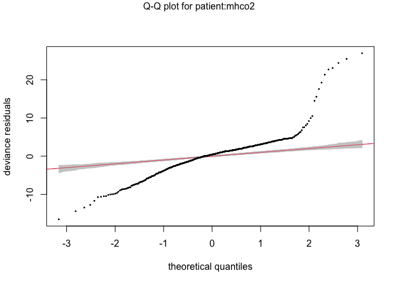
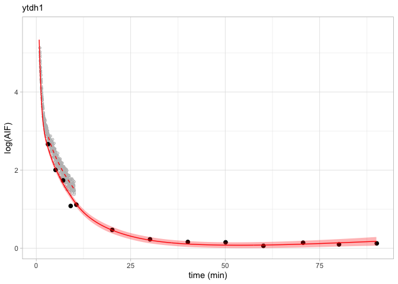

ModelAIF\_Demonstration
================
Liner Ge
7/7/2022

-   [Aims](#aims)
-   [Preparation](#preparation)
    -   [Libraries](#libraries)
    -   [Loading data](#loading-data)
-   [Data](#data)
    -   [General Approach](#general-approach)
    -   [Example Data](#example-data)
-   [Modelling](#modelling)
    -   [Offsets](#offsets)
    -   [1. Parametric (tri-exponential) Poisson
        Regression](#1-parametric-tri-exponential-poisson-regression)
    -   [2. Non-parametric Poisson
        Regression](#2-non-parametric-poisson-regression)
        -   [Problem of over-dispersion](#problem-of-over-dispersion)
    -   [3. Non-parametric Model with Negative Binomial
        distribution](#3-non-parametric-model-with-negative-binomial-distribution)
        -   [Problem of excessive
            wiggliness](#problem-of-excessive-wiggliness)
        -   [Solved problem of excessive
            wiggliness](#solved-problem-of-excessive-wiggliness)
        -   [Figure](#figure)
    -   [4. A model across all patients](#4-a-model-across-all-patients)
    -   [5. Hierarchical extrapolation](#5-hierarchical-extrapolation)
        -   [First and last samples](#first-and-last-samples)
        -   [Last samples](#last-samples)
        -   [First samples](#first-samples)
        -   [Figure](#figure-1)

# Aims

Here I aim to demonstrate the use of our work to model the arterial
input function for PET imaging using count data. Firstly, I will go
through how we arrange the data ready for these models. Next, I will
demonstrate the application of each model to this data.

# Preparation

## Libraries

We’ll also load the model functions as well as some helper functions
which we’ll use along the way.

``` r
source("model_functions.R")
source("helper_functions.R")
```

## Loading data

I have saved the prepared AIF data in the Rawdata folder. This dataset
consists of 10 patients.

``` r
# load data
filenames = list.files(path = "../Rawdata", pattern="*.csv") ##name of files
data = tibble(
  patient = substr(filenames,1,5), #the first 5 character of filenames
  count = map(filenames,~read.csv(paste0("../Rawdata/", .)) %>% select(-X))
) %>% 
  mutate(count = map(count, ~.x %>% 
                          mutate(Discrete=Method=="Discrete")))
```

# Data

## General Approach

Conventionally, modelling of the input function is performed by
converting all the count data into radioactivity. We also estimate
values of the whole-blood-to-plasma ratio (BPR) using blood
radioactivity and plasma radioactivity values, which are either modelled
or interpolated from a few data points. We also estimate values of the
plasma parent fraction using measured values, which are either
interpolated or modelled.

In this approach, we model the input function using the original count
data, i.e. before converting the data to radioactivity. However, we
still require estimates of the BPR and parent fraction over time. For
this reason, the data must firstly be processed in a conventional manner
with radioactivity to derive estimates of the BPR and plasma parent
fraction, as well as for assessing the effects of dispersion correction.

In the data below, then, there will both be count data, as well as
processed data generated using the counts data converted to
radioactivity. The strategy of this model is to make use of the counts
data to allow a us to model the data with a more correct error
distribution, but this requires first processing the data in a more
conventional manner, and using the counts once again when applying the
model itself.

## Example Data

We’ll start out by looking at one of the individuals within the dataset.
The data is as follows:

``` r
subject_1 = data$count[1]%>% 
  as.data.frame()

datatable(subject_1)
```

    ## PhantomJS not found. You can install it with webshot::install_phantomjs(). If it is installed, please make sure the phantomjs executable can be found via the PATH variable.

<div id="htmlwidget-4b90f7a66225543825d4" style="width:100%;height:auto;" class="datatables html-widget"></div>
<script type="application/json" data-for="htmlwidget-4b90f7a66225543825d4">{"x":{"filter":"none","vertical":false,"data":[["1","2","3","4","5","6","7","8","9","10","11","12","13","14","15","16","17","18","19","20","21","22","23","24","25","26","27","28","29","30","31","32","33","34","35","36","37","38","39","40","41","42","43","44","45","46","47","48","49","50","51","52","53","54","55","56","57","58","59","60","61","62","63","64","65","66","67","68","69","70","71","72","73","74","75","76","77","78","79","80","81","82","83","84","85","86","87","88","89","90","91","92","93","94","95","96","97","98","99","100","101","102","103","104","105","106","107","108","109","110","111","112","113","114","115","116","117","118","119","120","121","122","123","124","125","126","127","128","129","130","131","132","133","134","135","136","137","138","139","140","141","142","143","144","145","146","147","148","149","150","151","152","153","154","155","156","157","158","159","160","161","162","163","164","165","166","167","168","169","170","171","172","173","174","175","176","177","178","179","180","181","182","183","184","185","186","187","188","189","190","191","192","193","194","195","196","197","198","199","200","201","202","203","204","205","206","207","208","209","210","211","212","213","214","215","216","217","218","219","220","221","222","223","224","225","226","227","228","229","230","231","232","233","234","235","236","237","238","239","240","241","242","243","244","245","246","247","248","249","250","251","252","253","254","255","256","257","258","259","260","261","262","263","264","265","266","267","268","269","270","271","272","273","274","275","276","277","278","279","280","281","282","283","284","285","286","287","288","289","290","291","292","293","294","295","296","297","298","299","300","301","302","303","304","305","306","307","308","309","310","311","312","313","314","315","316","317","318","319","320","321","322","323","324","325","326","327","328","329","330","331","332","333","334","335","336","337","338","339","340","341","342","343","344","345","346","347","348","349","350","351","352","353","354","355","356","357","358","359","360","361","362","363","364","365","366","367","368","369","370","371","372","373","374","375","376","377","378","379","380","381","382","383","384","385","386","387","388","389","390","391","392","393","394","395","396","397","398","399","400","401","402","403","404","405","406","407","408","409","410","411","412","413","414","415","416","417","418","419","420","421","422","423","424","425","426","427","428","429","430","431","432","433","434","435","436","437","438","439","440","441","442","443","444","445","446","447","448","449","450","451","452","453","454","455","456","457","458","459","460","461","462","463","464","465","466","467","468","469","470","471","472","473","474","475","476","477","478","479","480","481","482","483","484","485","486","487","488","489","490","491","492","493","494","495","496","497","498","499","500","501","502","503","504","505","506","507","508","509","510","511","512","513","514","515","516","517","518","519","520","521","522","523","524","525","526","527","528","529","530","531","532","533","534","535","536","537","538","539","540","541","542","543","544","545","546","547","548","549","550","551","552","553","554","555","556","557","558","559","560","561","562","563","564","565","566","567","568","569","570","571","572","573","574","575","576","577","578","579","580","581","582","583","584","585","586","587","588","589","590","591","592","593","594","595","596","597","598","599","600","601","602","603","604","605","606","607","608","609"],[0.016666667,0.033333333,0.05,0.066666667,0.083333333,0.1,0.116666667,0.133333333,0.15,0.166666667,0.183333333,0.2,0.216666667,0.233333333,0.25,0.266666667,0.283333333,0.3,0.316666667,0.333333333,0.35,0.366666667,0.383333333,0.4,0.416666667,0.433333333,0.45,0.466666667,0.483333333,0.5,0.516666667,0.533333333,0.55,0.566666667,0.583333333,0.6,0.616666667,0.633333333,0.65,0.666666667,0.683333333,0.7,0.716666667,0.733333333,0.75,0.766666667,0.783333333,0.8,0.816666667,0.833333333,0.85,0.866666667,0.883333333,0.9,0.916666667,0.933333333,0.95,0.966666667,0.983333333,1,1.016666667,1.033333333,1.05,1.066666667,1.083333333,1.1,1.116666667,1.133333333,1.15,1.166666667,1.183333333,1.2,1.216666667,1.233333333,1.25,1.266666667,1.283333333,1.3,1.316666667,1.333333333,1.35,1.366666667,1.383333333,1.4,1.416666667,1.433333333,1.45,1.466666667,1.483333333,1.5,1.516666667,1.533333333,1.55,1.566666667,1.583333333,1.6,1.616666667,1.633333333,1.65,1.666666667,1.683333333,1.7,1.716666667,1.733333333,1.75,1.766666667,1.783333333,1.8,1.816666667,1.833333333,1.85,1.866666667,1.883333333,1.9,1.916666667,1.933333333,1.95,1.966666667,1.983333333,2,2.016666667,2.033333333,2.05,2.066666667,2.083333333,2.1,2.116666667,2.133333333,2.15,2.166666667,2.183333333,2.2,2.216666667,2.233333333,2.25,2.266666667,2.283333333,2.3,2.316666667,2.333333333,2.35,2.366666667,2.383333333,2.4,2.416666667,2.433333333,2.45,2.466666667,2.483333333,2.5,2.516666667,2.533333333,2.55,2.566666667,2.583333333,2.6,2.616666667,2.633333333,2.65,2.666666667,2.683333333,2.7,2.716666667,2.733333333,2.75,2.766666667,2.783333333,2.8,2.816666667,2.833333333,2.85,2.866666667,2.883333333,2.9,2.916666667,2.933333333,2.95,2.966666667,2.983333333,3,3.016666667,3.033333333,3.05,3.066666667,3.083333333,3.1,3.116666667,3.133333333,3.15,3.166666667,3.183333333,3.2,3.216666667,3.233333333,3.25,3.266666667,3.283333333,3.3,3.316666667,3.333333333,3.35,3.366666667,3.383333333,3.4,3.416666667,3.433333333,3.45,3.466666667,3.483333333,3.5,3.516666667,3.533333333,3.55,3.566666667,3.583333333,3.6,3.616666667,3.633333333,3.65,3.666666667,3.683333333,3.7,3.716666667,3.733333333,3.75,3.766666667,3.783333333,3.8,3.816666667,3.833333333,3.85,3.866666667,3.883333333,3.9,3.916666667,3.933333333,3.95,3.966666667,3.983333333,4,4.016666667,4.033333333,4.05,4.066666667,4.083333333,4.1,4.116666667,4.133333333,4.15,4.166666667,4.183333333,4.2,4.216666667,4.233333333,4.25,4.266666667,4.283333333,4.3,4.316666667,4.333333333,4.35,4.366666667,4.383333333,4.4,4.416666667,4.433333333,4.45,4.466666667,4.483333333,4.5,4.516666667,4.533333333,4.55,4.566666667,4.583333333,4.6,4.616666667,4.633333333,4.65,4.666666667,4.683333333,4.7,4.716666667,4.733333333,4.75,4.766666667,4.783333333,4.8,4.816666667,4.833333333,4.85,4.866666667,4.883333333,4.9,4.916666667,4.933333333,4.95,4.966666667,4.983333333,5,5.016666667,5.033333333,5.05,5.066666667,5.083333333,5.1,5.116666667,5.133333333,5.15,5.166666667,5.183333333,5.2,5.216666667,5.233333333,5.25,5.266666667,5.283333333,5.3,5.316666667,5.333333333,5.35,5.366666667,5.383333333,5.4,5.416666667,5.433333333,5.45,5.466666667,5.483333333,5.5,5.516666667,5.533333333,5.55,5.566666667,5.583333333,5.6,5.616666667,5.633333333,5.65,5.666666667,5.683333333,5.7,5.716666667,5.733333333,5.75,5.766666667,5.783333333,5.8,5.816666667,5.833333333,5.85,5.866666667,5.883333333,5.9,5.916666667,5.933333333,5.95,5.966666667,5.983333333,6,6.016666667,6.033333333,6.05,6.066666667,6.083333333,6.1,6.116666667,6.133333333,6.15,6.166666667,6.183333333,6.2,6.216666667,6.233333333,6.25,6.266666667,6.283333333,6.3,6.316666667,6.333333333,6.35,6.366666667,6.383333333,6.4,6.416666667,6.433333333,6.45,6.466666667,6.483333333,6.5,6.516666667,6.533333333,6.55,6.566666667,6.583333333,6.6,6.616666667,6.633333333,6.65,6.666666667,6.683333333,6.7,6.716666667,6.733333333,6.75,6.766666667,6.783333333,6.8,6.816666667,6.833333333,6.85,6.866666667,6.883333333,6.9,6.916666667,6.933333333,6.95,6.966666667,6.983333333,7,7.016666667,7.033333333,7.05,7.066666667,7.083333333,7.1,7.116666667,7.133333333,7.15,7.166666667,7.183333333,7.2,7.216666667,7.233333333,7.25,7.266666667,7.283333333,7.3,7.316666667,7.333333333,7.35,7.366666667,7.383333333,7.4,7.416666667,7.433333333,7.45,7.466666667,7.483333333,7.5,7.516666667,7.533333333,7.55,7.566666667,7.583333333,7.6,7.616666667,7.633333333,7.65,7.666666667,7.683333333,7.7,7.716666667,7.733333333,7.75,7.766666667,7.783333333,7.8,7.816666667,7.833333333,7.85,7.866666667,7.883333333,7.9,7.916666667,7.933333333,7.95,7.966666667,7.983333333,8,8.016666667,8.033333333,8.05,8.066666667,8.083333333,8.1,8.116666667,8.133333333,8.15,8.166666667,8.183333333,8.2,8.216666667,8.233333333,8.25,8.266666667,8.283333333,8.3,8.316666667,8.333333333,8.35,8.366666667,8.383333333,8.4,8.416666667,8.433333333,8.45,8.466666667,8.483333333,8.5,8.516666667,8.533333333,8.55,8.566666667,8.583333333,8.6,8.616666667,8.633333333,8.65,8.666666667,8.683333333,8.7,8.716666667,8.733333333,8.75,8.766666667,8.783333333,8.8,8.816666667,8.833333333,8.85,8.866666667,8.883333333,8.9,8.916666667,8.933333333,8.95,8.966666667,8.983333333,9,9.016666667,9.033333333,9.05,9.066666667,9.083333333,9.1,9.116666667,9.133333333,9.15,9.166666667,9.183333333,9.2,9.216666667,9.233333333,9.25,9.266666667,9.283333333,9.3,9.316666667,9.333333333,9.35,9.366666667,9.383333333,9.4,9.416666667,9.433333333,9.45,9.466666667,9.483333333,9.5,9.516666667,9.533333333,9.55,9.566666667,9.583333333,9.6,9.616666667,9.633333333,9.65,9.666666667,9.683333333,9.7,9.716666667,9.733333333,9.75,9.766666667,9.783333333,9.8,9.816666667,9.833333333,9.85,9.866666667,9.883333333,9.9,9.916666667,9.933333333,9.95,9.966666667,9.983333333,10,10.66666667,20.41666667,30,40,50,60,70,80,90],["Continuous","Continuous","Continuous","Continuous","Continuous","Continuous","Continuous","Continuous","Continuous","Continuous","Continuous","Continuous","Continuous","Continuous","Continuous","Continuous","Continuous","Continuous","Continuous","Continuous","Continuous","Continuous","Continuous","Continuous","Continuous","Continuous","Continuous","Continuous","Continuous","Continuous","Continuous","Continuous","Continuous","Continuous","Continuous","Continuous","Continuous","Continuous","Continuous","Continuous","Continuous","Continuous","Continuous","Continuous","Continuous","Continuous","Continuous","Continuous","Continuous","Continuous","Continuous","Continuous","Continuous","Continuous","Continuous","Continuous","Continuous","Continuous","Continuous","Continuous","Continuous","Continuous","Continuous","Continuous","Continuous","Continuous","Continuous","Continuous","Continuous","Continuous","Continuous","Continuous","Continuous","Continuous","Continuous","Continuous","Continuous","Continuous","Continuous","Continuous","Continuous","Continuous","Continuous","Continuous","Continuous","Continuous","Continuous","Continuous","Continuous","Continuous","Continuous","Continuous","Continuous","Continuous","Continuous","Continuous","Continuous","Continuous","Continuous","Continuous","Continuous","Continuous","Continuous","Continuous","Continuous","Continuous","Continuous","Continuous","Continuous","Continuous","Continuous","Continuous","Continuous","Continuous","Continuous","Continuous","Continuous","Continuous","Continuous","Continuous","Continuous","Continuous","Continuous","Continuous","Continuous","Continuous","Continuous","Continuous","Continuous","Continuous","Continuous","Continuous","Continuous","Continuous","Continuous","Continuous","Continuous","Continuous","Continuous","Continuous","Continuous","Continuous","Continuous","Continuous","Continuous","Continuous","Continuous","Continuous","Continuous","Continuous","Continuous","Continuous","Continuous","Continuous","Continuous","Continuous","Continuous","Continuous","Continuous","Continuous","Continuous","Continuous","Continuous","Continuous","Continuous","Continuous","Continuous","Continuous","Continuous","Continuous","Continuous","Continuous","Continuous","Continuous","Continuous","Continuous","Continuous","Continuous","Continuous","Discrete","Continuous","Continuous","Continuous","Continuous","Continuous","Continuous","Continuous","Continuous","Continuous","Continuous","Continuous","Continuous","Continuous","Continuous","Continuous","Continuous","Continuous","Continuous","Continuous","Continuous","Continuous","Continuous","Continuous","Continuous","Continuous","Continuous","Continuous","Continuous","Continuous","Continuous","Continuous","Continuous","Continuous","Continuous","Continuous","Continuous","Continuous","Continuous","Continuous","Continuous","Continuous","Continuous","Continuous","Continuous","Continuous","Continuous","Continuous","Continuous","Continuous","Continuous","Continuous","Continuous","Continuous","Continuous","Continuous","Continuous","Continuous","Continuous","Continuous","Continuous","Continuous","Continuous","Continuous","Continuous","Continuous","Continuous","Continuous","Continuous","Continuous","Continuous","Continuous","Continuous","Continuous","Continuous","Continuous","Continuous","Continuous","Continuous","Continuous","Continuous","Continuous","Continuous","Continuous","Continuous","Continuous","Continuous","Continuous","Continuous","Continuous","Continuous","Continuous","Continuous","Continuous","Continuous","Continuous","Continuous","Continuous","Continuous","Continuous","Continuous","Continuous","Continuous","Continuous","Continuous","Continuous","Continuous","Continuous","Continuous","Continuous","Continuous","Continuous","Continuous","Continuous","Continuous","Continuous","Continuous","Continuous","Continuous","Continuous","Discrete","Continuous","Continuous","Continuous","Continuous","Continuous","Continuous","Continuous","Continuous","Continuous","Continuous","Continuous","Continuous","Continuous","Continuous","Continuous","Continuous","Continuous","Continuous","Continuous","Continuous","Continuous","Continuous","Continuous","Continuous","Continuous","Continuous","Continuous","Continuous","Continuous","Continuous","Continuous","Continuous","Continuous","Continuous","Continuous","Continuous","Continuous","Continuous","Continuous","Continuous","Continuous","Continuous","Continuous","Continuous","Continuous","Continuous","Continuous","Continuous","Continuous","Continuous","Continuous","Continuous","Continuous","Continuous","Continuous","Continuous","Continuous","Continuous","Continuous","Continuous","Continuous","Continuous","Continuous","Continuous","Continuous","Continuous","Continuous","Continuous","Continuous","Continuous","Continuous","Continuous","Continuous","Continuous","Continuous","Continuous","Continuous","Continuous","Continuous","Continuous","Continuous","Continuous","Continuous","Continuous","Continuous","Continuous","Continuous","Continuous","Continuous","Continuous","Continuous","Continuous","Continuous","Continuous","Continuous","Continuous","Continuous","Continuous","Continuous","Continuous","Continuous","Continuous","Continuous","Continuous","Continuous","Continuous","Continuous","Continuous","Continuous","Continuous","Continuous","Continuous","Continuous","Continuous","Continuous","Continuous","Continuous","Continuous","Continuous","Discrete","Continuous","Continuous","Continuous","Continuous","Continuous","Continuous","Continuous","Continuous","Continuous","Continuous","Continuous","Continuous","Continuous","Continuous","Continuous","Continuous","Continuous","Continuous","Continuous","Continuous","Continuous","Continuous","Continuous","Continuous","Continuous","Continuous","Continuous","Continuous","Continuous","Continuous","Continuous","Continuous","Continuous","Continuous","Continuous","Continuous","Continuous","Continuous","Continuous","Continuous","Continuous","Continuous","Continuous","Continuous","Continuous","Continuous","Continuous","Continuous","Continuous","Continuous","Continuous","Continuous","Continuous","Continuous","Continuous","Continuous","Continuous","Continuous","Continuous","Continuous","Continuous","Continuous","Continuous","Continuous","Continuous","Continuous","Continuous","Continuous","Continuous","Continuous","Continuous","Continuous","Continuous","Continuous","Continuous","Continuous","Continuous","Continuous","Continuous","Continuous","Continuous","Continuous","Continuous","Continuous","Continuous","Continuous","Continuous","Continuous","Continuous","Continuous","Continuous","Continuous","Continuous","Continuous","Continuous","Continuous","Continuous","Continuous","Continuous","Continuous","Continuous","Continuous","Continuous","Continuous","Continuous","Continuous","Continuous","Continuous","Continuous","Continuous","Continuous","Continuous","Continuous","Continuous","Continuous","Continuous","Continuous","Continuous","Continuous","Discrete","Continuous","Continuous","Continuous","Continuous","Continuous","Continuous","Continuous","Continuous","Continuous","Continuous","Continuous","Continuous","Continuous","Continuous","Continuous","Continuous","Continuous","Continuous","Continuous","Continuous","Continuous","Continuous","Continuous","Continuous","Continuous","Continuous","Continuous","Continuous","Continuous","Continuous","Continuous","Continuous","Continuous","Continuous","Continuous","Continuous","Continuous","Continuous","Continuous","Continuous","Continuous","Continuous","Continuous","Continuous","Continuous","Continuous","Continuous","Continuous","Continuous","Continuous","Continuous","Continuous","Continuous","Continuous","Continuous","Continuous","Continuous","Continuous","Continuous","Continuous","Discrete","Discrete","Discrete","Discrete","Discrete","Discrete","Discrete","Discrete","Discrete"],[0.010705,-0.03466,-0.18411,-0.01715,0.17808,0.025045,-0.200685,0.268655,0.05435,-0.262315,0.178655,0.251705,-0.264245,0.16301,0.266715,-0.204495,0.28345,-0.037905,0.191465,0.28072,-0.02421,0.3267,0.03595,1.13244,4.60656,10.928825,23.254195,39.350315,56.30731,71.00087,90.91973,110.807045,123.00872,136.43898,141.55312,139.64651,130.148055,134.14017,131.831,120.514365,121.55869,107.551045,108.273285,107.00178,104.24084,96.640485,79.51596,82.70055,86.57408,81.88655,74.22718,72.05269,72.86336,67.04585,62.9148,56.94892,52.92369,56.31955,53.682005,50.629135,48.049495,47.08731,48.795045,45.57512,45.96769,43.3455,38.636695,42.045135,41.998515,36.134385,33.90162,35.162645,33.09247,32.3436,30.397165,30.837695,29.769135,29.236965,28.58798,23.93563,26.7334,29.904505,25.574925,21.92243,25.31656,26.46721,23.92148,24.33397,21.296105,20.779145,24.123785,24.17128,21.914325,22.71965,21.531505,20.4675,21.910125,20.03432,19.20901,21.972815,23.46385,20.05098,18.379985,19.215685,19.430415,17.869815,16.147225,18.660645,18.378265,19.492015,20.52854,18.237085,18.03457,19.271665,17.209345,17.35108,17.46542,15.79864,17.352925,15.386425,17.584825,17.3096,14.00396,17.21558,15.649445,16.65215,18.009445,14.922825,14.240805,16.45159,19.779835,15.659635,14.990235,16.245435,14.82894,15.078395,16.08382,16.898075,16.99289,17.13909,17.97082,15.234185,13.864335,14.485025,14.799945,16.164815,16.506325,16.40653,13.226295,14.04858,15.42294,15.53981,14.59308,13.675595,13.15564,13.63838,15.94617,14.91704,13.74045,13.233015,13.993025,14.23126,13.36511,13.726775,12.351235,14.204965,15.07668,15.401745,13.6941,11.49973,15.46887,12.824595,11.240715,13.04353,12.2547,14.37479,13.567995,12.18019,12.5469,13.0177,16.37035,14.579705,11.1552,12.759865,13.204195,11.844615,12.932545,13.204135,11.58728,12.712265,11.628735,10.77706,14.463975,13.47217,11.779945,10.909715,12.292825,12.782525,12.247285,13.2797,12.839765,11.75112,12.20646,12.298755,10.924995,13.71231,13.952425,10.889685,10.884235,12.561735,10.361915,10.269315,12.96216,11.98439,11.819985,12.946245,13.467335,11.797765,9.45205,10.252935,12.6857,11.84106,11.82922,11.83396,11.772035,12.238305,12.087695,11.27227,10.893865,12.413485,11.58959,10.400815,9.615815,11.79835,13.679065,11.738975,10.90717,11.42142,11.84219,11.536135,8.8765,10.01302,11.54051,9.400385,11.835445,11.8425,10.77019,10.79685,9.47532,10.344245,10.091565,9.720435,9.73283,12.932015,11.641135,8.27658,10.307255,9.756925,12.15016,11.037975,8.520625,12.25802,10.76054,9.967155,10.799555,9.110825,9.5687,10.64575,10.50483,8.30387,9.397455,11.52276,6.901135,8.41474,12.23081,8.886635,9.06264,11.778955,11.21547,10.174745,9.11046,12.33554,11.9277,6.970775,7.90012,12.001925,11.48342,8.91496,8.86536,9.66192,10.83477,10.103295,10.28574,10.200645,11.6606,10.017865,8.64587,10.784255,11.563425,7.4932,8.012095,6.9967,10.06052,10.41134,9.103705,9.186475,9.999005,9.765515,8.85748,8.119835,8.83669,10.77719,9.652795,9.048255,10.11674,8.948145,7.757915,8.2471,11.11818,12.17773,9.22193,9.888915,9.47923,6.623555,10.68531,10.75941,7.573545,8.794275,9.50781,9.45372,10.634365,11.458695,7.56688,8.1094,8.398065,5.21434,9.39794,11.00105,10.65232,15.520745,11.20436,7.77351,7.19338,7.79757,10.33408,9.247575,8.521395,9.15692,9.635805,8.666205,8.090185,7.941885,8.724385,9.18572,10.04715,7.982355,7.816195,8.713555,9.838955,9.922115,8.9056,8.89615,9.254985,9.811695,9.75509,9.44219,12.31383,8.571865,10.376925,10.501295,7.5612,10.27749,8.75374,7.24485,8.684805,9.077545,8.70905,11.744915,8.12874,8.7295,9.296695,7.194345,10.0358,10.08035,7.29301,8.75838,8.94846,9.0268,8.598535,7.16516,9.50947,9.63262,9.103395,8.750835,6.411175,6.94925,10.856915,10.961515,8.68699,6.96706,7.71132,10.45748,8.742295,7.99519,8.725975,13.87184,11.193235,7.84636,9.391475,8.436395,9.304785,8.02102,8.9303,7.643275,7.243405,9.00853,8.566895,6.11538,9.36201,7.2701,9.024985,9.0866,7.10688,8.20065,8.532015,9.39615,9.25623,7.99378,7.356155,8.21785,8.278495,7.439335,9.486245,8.65015,7.443215,7.78539,9.275355,9.03649,7.322285,9.036085,8.55003,7.35937,9.18928,8.02441,7.764345,9.37859,7.63048,7.33578,8.31704,7.795185,9.043375,8.221885,6.9678,9.62685,9.671295,7.74001,8.02807,7.180895,9.02891,9.722845,7.14133,7.259985,7.996285,7.609505,8.20472,9.55362,7.723205,8.010615,7.585435,7.166235,10.08045,9.07974,7.449945,6.76,7.566455,7.788265,8.34415,7.35712,5.930975,8.41636,8.52615,7.65362,8.055655,7.9583,8.87181,8.17367,7.86406,8.286895,6.44777,8.392435,9.478945,8.39668,7.09049,8.043055,9.43777,8.652655,9.43208,7.515425,6.3793,8.417585,8.39465,7.277565,7.55034,8.656235,8.41196,6.5529,7.715255,9.840485,8.862135,8.30108,8.88961,8.368515,8.1154,8.94726,8.464545,7.34441,6.89801,8.30525,7.69847,8.048905,8.656315,7.20097,8.043425,10.10757,9.058105,6.83389,6.99969,8.454735,9.82999,7.504395,7.642855,8.606465,8.667645,8.626575,7.12464,6.38964,8.549,8.33794,6.178095,6.5161,9.527145,8.825265,10.011775,7.44809,7.34803,9.042545,7.912445,7.369685,8.613395,8.26284,6.132585,7.924575,9.09566,5.98203,8.00407,9.17419,7.578785,8.14457,8.45708,10.14921,8.502375,5.558535,7.45482,8.05966,8.08162,9.676335,8.585825,6.766235,8.01208,9.653995,7.52406,8.20505,8.582205,6.77518,7.086855,8.28536,8.07374,7.78478,9.249325,8.071625,8.37218,9.544485,6.69415,5.863015,8.859825,8.534,5.36929,7.015205,8.71847,7.84738,9.298845,9.245235,7.74779,8.560325,7.9514,7.940655,8.031875,6.73098,7.17121,4.89905,6.2278,6.4188,6.6448,6.6311,6.6667,6.5427,6.3844,5.7221,6.5509],[2,0,2,0,0,0,3,0,0,3,0,0,3,1,0,5,0,0,6,0,9,0,5,4,2,26,93,226,498,852,1292,1710,2307,2830,3330,3814,4106,4296,4224,4461,4284,4254,4165,3868,3918,3672,3724,3375,3151,3055,3017,2862,2720,2613,2568,2384,2323,2089,2036,1967,1896,1806,1731,1673,1677,1567,1613,1467,1444,1425,1414,1279,1267,1206,1173,1126,1077,1070,1016,1017,966,884,935,930,874,811,865,829,823,809,745,745,772,764,737,757,707,714,708,675,664,703,714,665,653,641,641,600,577,609,577,632,614,609,594,621,559,600,547,557,550,518,569,525,505,548,488,557,522,516,480,533,560,502,525,504,497,490,508,514,526,529,553,491,499,467,489,488,510,500,453,478,466,489,454,462,425,452,465,458,445,434,444,438,429,435,399,452,428,478,411,422,453,397,404,400,390,433,396,17517,387,416,455,426,393,416,395,390,399,398,372,402,353,372,406,388,383,355,388,368,386,387,390,368,386,367,358,403,387,362,359,376,325,351,361,356,361,378,386,362,329,339,361,344,364,346,364,355,367,341,350,359,346,333,313,353,363,349,344,346,350,344,297,330,317,302,345,321,337,316,308,313,301,301,293,357,306,301,307,291,346,296,301,337,300,321,305,292,294,305,300,267,295,304,232,290,295,269,284,313,303,306,278,350,300,271,264,324,290,293,268,293,290,294,294,295,322,283,288,11927,314,312,261,257,281,277,270,271,281,274,266,250,263,284,265,274,278,261,247,249,292,299,271,297,262,238,297,263,255,257,264,262,289,294,239,270,228,204,260,255,288,363,282,296,226,269,254,268,240,270,250,259,232,244,236,255,259,233,241,237,264,254,257,249,260,261,267,260,318,227,328,236,281,253,265,215,265,222,263,275,234,266,238,231,265,250,228,251,232,255,227,226,249,243,251,238,206,217,261,256,247,216,233,255,229,239,231,331,246,282,240,261,241,239,242,217,220,233,223,9649,252,234,252,235,218,231,221,248,230,232,208,232,209,218,235,221,216,214,237,224,214,238,215,218,233,210,223,231,207,215,213,210,231,208,208,238,229,219,221,199,239,223,211,206,212,200,218,227,205,223,195,209,235,219,214,193,210,194,220,184,189,205,205,201,209,202,225,201,219,204,190,217,217,217,195,218,219,221,234,199,200,210,207,196,202,211,208,184,209,220,217,216,224,212,217,221,215,201,194,210,190,213,202,197,205,233,212,201,193,212,223,194,213,203,220,207,198,180,215,9526,185,223,208,227,230,200,210,214,201,199,211,200,177,206,200,171,209,196,200,199,207,231,202,180,198,187,203,216,205,188,206,215,190,215,196,190,184,201,188,199,210,195,212,215,180,180,204,191,161,188,186,191,211,207,198,211,191,206,189,184,17134,12456,7921,8572,4233,3782,2221,1489,1428],[0.080553813,-0.120910058,0.080659461,-0.154698107,-0.053842982,-0.121225047,0.114564018,-0.121380784,-0.0539814,0.114783209,-0.054049692,-0.121688073,0.114999283,0.047381996,-0.155779609,0.182983668,0.013562591,-0.054283145,0.217262908,-0.156250803,0.319484119,-0.020404588,0.183748427,0.149807637,0.081760213,0.899875152,3.185450181,7.725809518,17.01716637,29.12006061,44.17569297,58.49512113,78.95475844,96.90241749,114.0807752,130.7282495,140.8086941,147.3994215,145.0029327,153.2150437,147.2097416,146.2510312,143.2613953,133.1108453,134.8957228,126.486584,128.3375051,116.3651711,108.6924753,105.4289504,104.1641371,98.85686587,93.99356092,90.33533873,88.81749614,82.48911818,80.41199089,72.34279608,70.53606643,68.1730669,65.73848431,62.64274617,60.06464854,58.07423334,58.23446289,54.43528555,56.05281747,50.99835131,50.2163122,49.57255281,49.20638297,44.5243584,44.12092526,42.01063742,40.87412813,39.24885305,37.55265415,37.31956095,35.44698124,35.49179089,33.72190386,30.86883776,32.65748075,32.49123127,30.54324313,28.349533,30.2434318,28.99204476,28.78880724,28.30553421,26.07295402,26.07836002,27.028412,26.75368783,25.81357481,26.51854478,24.77228878,25.02168396,24.81561062,23.66334341,23.28148181,24.65168495,25.04068715,23.32627781,22.90851428,22.49050409,22.49307961,21.05754161,20.25293964,21.37742185,20.25669212,22.18808183,21.55820176,21.38427243,20.85925568,21.80803354,19.63316163,21.07309166,19.21363018,19.56527373,19.32008293,18.19719367,19.98770892,18.44331636,17.74127566,19.25063127,17.1442453,19.56600374,18.33699013,18.12583807,16.8616125,18.72106819,19.6677425,17.6312075,18.43723534,17.69910805,17.45218964,17.20519949,17.83516663,18.04397591,18.463077,18.56634142,19.40586567,17.22970196,17.50802574,16.38402689,17.15285817,17.1153608,17.88365268,17.53054056,15.88141737,16.75428673,16.33118277,17.13344461,15.90515719,16.18205581,14.88424765,15.82569675,16.27701545,16.02870642,15.5706544,15.18261496,15.52845492,15.31508823,14.99695513,15.20263634,13.94200751,15.78788524,14.94625154,16.68602182,14.34505078,14.72431969,15.80024183,13.84453388,14.08404009,13.94033407,13.58780514,15.07947364,13.78751782,7.762718389,13.46525492,14.46815162,15.81758345,14.80493474,13.65410603,14.44696686,13.71314577,13.53449778,13.84107264,13.80091293,12.89503162,13.92811754,12.22700735,12.87893491,14.04876346,13.4207019,13.24211069,12.26956372,13.40278377,12.70682392,13.32151513,13.3497384,13.44674314,12.68290139,13.29613286,12.63613219,12.32047191,13.86044357,13.30394104,12.43901288,12.32964054,12.90607424,11.15146405,12.03603647,12.37185703,12.19402448,12.35827233,12.93238477,13.19836462,12.37155681,11.23855753,11.57303562,12.31600176,11.72974457,12.40352944,11.78376274,12.38857534,12.07521912,12.4752444,11.58519808,11.88315636,12.18067323,11.73260247,11.28503931,10.60120527,11.94646291,12.2764285,11.79565675,11.61909425,11.67870601,11.80555649,11.59548329,10.0061694,11.10876908,10.66423444,10.15311405,11.58863787,10.77572216,11.30404627,10.59281894,10.31747841,10.47707915,10.06849204,10.06102682,9.78667078,11.91250708,10.20490795,10.03074631,10.22260314,9.68306403,11.5017718,9.833919931,9.991974765,11.17662776,9.943088169,10.62969791,10.09243159,9.655036827,9.713197489,10.06791092,9.894964932,8.800712293,9.714201344,10.00183201,7.62969976,9.525822411,9.681642482,8.821998302,9.305248056,10.24529588,9.909834794,9.999150585,9.077479627,11.41510885,9.777639239,8.825925726,8.590658446,10.53073456,9.418581555,9.507324818,8.689370927,9.490122488,9.384529287,9.50508842,9.496355065,9.519819896,10.38031913,9.116146349,9.268315676,4.832434923,10.0848959,10.01126897,8.368956237,8.233040701,8.992081322,8.85575145,8.623963406,8.647483711,8.95740353,8.726071076,8.463381491,7.947262426,8.351625612,9.008559485,8.398383321,8.674539145,8.792200604,8.247048099,7.797506929,7.852613203,9.197194485,9.407811682,8.519302952,9.325909023,8.219939738,7.460436838,9.297170504,8.225760441,7.967650494,8.021686227,8.231234671,8.160418612,8.990645772,9.13634746,7.421643482,8.373797939,7.065622896,6.316442384,8.03838229,7.875594463,8.8836459,11.18183818,8.68008632,9.100545121,6.943753269,8.253590232,7.785539029,8.20501124,7.340997124,8.248026377,7.629556487,7.895059634,7.065467635,7.422055767,7.171130015,7.738860673,7.851290106,7.056441408,7.290123991,7.161270199,7.96675456,7.656789171,7.738319966,7.489315402,7.810757674,7.831830347,8.002461524,7.784069141,9.506951879,6.782038583,9.783033488,7.034245245,8.363591704,7.522688885,7.869809914,6.379768773,7.851545731,6.5717818,7.774229163,8.118912047,6.902127346,7.835201619,7.00344862,6.789815035,7.778279822,7.330003718,6.678091663,7.341877668,6.778955542,7.441004243,6.61735344,6.580406589,7.240264333,7.057639222,7.280887316,6.89611827,5.96330226,6.273568207,7.534213192,7.381198277,7.113517023,6.214655707,6.694761701,7.316930728,6.564090751,6.841916403,6.605242649,9.448200231,7.016294618,8.031593317,6.828742983,7.416185168,6.840381504,6.775396076,6.851884868,6.13766674,6.214713436,6.573180566,6.283802403,2.987240413,7.08200707,6.568824249,7.064507555,6.580531871,6.097736617,6.452683649,6.166164934,6.909539932,6.400878131,6.448404682,5.775272665,6.432341122,5.788517399,6.029767746,6.490994844,6.097318138,5.952158871,5.88976072,6.513415712,6.149017878,5.867621884,6.516248644,5.880182198,5.95457874,6.355536669,5.722024757,6.06791438,6.277281056,5.61912364,5.828500413,5.767087371,5.678825561,6.237729327,5.610621495,5.603518002,6.402046583,6.152551288,5.876888322,5.922937622,5.327619168,6.388227837,5.953706398,5.626741862,5.486675059,5.638990736,5.31363472,5.783537,6.014202574,5.425434779,5.893368636,5.148149503,5.509970181,6.186212641,5.758384546,5.61997422,5.063040102,5.501053232,5.076231888,5.747801148,4.802815369,4.926740234,5.336109513,5.329288553,5.218824191,5.419187665,5.231331593,5.81834944,5.192176292,5.648987243,5.256041768,4.889773585,5.576031078,5.568894384,5.561766333,4.992539197,5.573054061,5.591404633,5.635151242,5.958394016,5.062212974,5.08108692,5.327804715,5.245114608,4.960567906,5.105568799,5.325769244,5.243470739,4.633678122,5.255154386,5.524135193,5.441970839,5.410008529,5.602832443,5.296432656,5.414180352,5.506746866,5.350663021,4.996499684,4.816673982,5.206446645,4.705517934,5.267200108,4.989315209,4.859848547,5.050348008,5.731484588,5.209143688,4.933066609,4.731074837,5.189241064,5.451030897,4.737377979,5.193769334,4.944083847,5.350486582,5.028488143,4.804160618,4.36274415,5.202552409,2.506618143,4.466591106,5.37523918,5.007958343,5.457604202,5.522590647,4.79741315,5.030421695,5.119563384,4.803052476,4.749336946,5.028784426,4.761088009,4.209328479,4.891250017,4.743065426,4.051573389,4.943577349,4.630822954,4.719181997,4.68971834,4.871730336,5.428639666,4.742328508,4.221545001,4.63693088,4.374343771,4.741862439,5.038604266,4.776488546,4.375672684,4.787729157,4.990244906,4.405545756,4.977776776,4.533028884,4.389060567,4.245447938,4.631059824,4.326737011,4.573659044,4.819963605,4.470770101,4.853694222,4.916138295,4.112214798,4.107116619,4.647752746,4.346764036,3.660918463,4.268056981,4.217532099,4.325317547,4.771391161,4.675339678,4.466947722,4.753783287,4.298747509,4.629943805,4.243385067,4.126294774,2.229845988,1.002706045,0.863597818,0.750987849,0.681063908,0.563308761,0.650435646,0.602733585,0.558697218],[11.6,11.6,11.6,11.6,11.6,11.6,11.6,11.6,11.6,11.6,11.6,11.6,11.6,11.6,11.6,11.6,11.6,11.6,11.6,11.6,11.6,11.6,11.6,11.6,11.6,11.6,11.6,11.6,11.6,11.6,11.6,11.6,11.6,11.6,11.6,11.6,11.6,11.6,11.6,11.6,11.6,11.6,11.6,11.6,11.6,11.6,11.6,11.6,11.6,11.6,11.6,11.6,11.6,11.6,11.6,11.6,11.6,11.6,11.6,11.6,11.6,11.6,11.6,11.6,11.6,11.6,11.6,11.6,11.6,11.6,11.6,11.6,11.6,11.6,11.6,11.6,11.6,11.6,11.6,11.6,11.6,11.6,11.6,11.6,11.6,11.6,11.6,11.6,11.6,11.6,11.6,11.6,11.6,11.6,11.6,11.6,11.6,11.6,11.6,11.6,11.6,11.6,11.6,11.6,11.6,11.6,11.6,11.6,11.6,11.6,11.6,11.6,11.6,11.6,11.6,11.6,11.6,11.6,11.6,11.6,11.6,11.6,11.6,11.6,11.6,11.6,11.6,11.6,11.6,11.6,11.6,11.6,11.6,11.6,11.6,11.6,11.6,11.6,11.6,11.6,11.6,11.6,11.6,11.6,11.6,11.6,11.6,11.6,11.6,11.6,11.6,11.6,11.6,11.6,11.6,11.6,11.6,11.6,11.6,11.6,11.6,11.6,11.6,11.6,11.6,11.6,11.6,11.6,11.6,11.6,11.6,11.6,11.6,11.6,11.6,11.6,11.6,11.6,11.6,53.71428571,11.6,11.6,11.6,11.6,11.6,11.6,11.6,11.6,11.6,11.6,11.6,11.6,11.6,11.6,11.6,11.6,11.6,11.6,11.6,11.6,11.6,11.6,11.6,11.6,11.6,11.6,11.6,11.6,11.6,11.6,11.6,11.6,11.6,11.6,11.6,11.6,11.6,11.6,11.6,11.6,11.6,11.6,11.6,11.6,11.6,11.6,11.6,11.6,11.6,11.6,11.6,11.6,11.6,11.6,11.6,11.6,11.6,11.6,11.6,11.6,11.6,11.6,11.6,11.6,11.6,11.6,11.6,11.6,11.6,11.6,11.6,11.6,11.6,11.6,11.6,11.6,11.6,11.6,11.6,11.6,11.6,11.6,11.6,11.6,11.6,11.6,11.6,11.6,11.6,11.6,11.6,11.6,11.6,11.6,11.6,11.6,11.6,11.6,11.6,11.6,11.6,11.6,11.6,11.6,11.6,11.6,11.6,11.6,11.6,11.6,11.6,11.6,11.6,11.6,11.6,11.6,11.6,11.6,11.6,53.71428571,11.6,11.6,11.6,11.6,11.6,11.6,11.6,11.6,11.6,11.6,11.6,11.6,11.6,11.6,11.6,11.6,11.6,11.6,11.6,11.6,11.6,11.6,11.6,11.6,11.6,11.6,11.6,11.6,11.6,11.6,11.6,11.6,11.6,11.6,11.6,11.6,11.6,11.6,11.6,11.6,11.6,11.6,11.6,11.6,11.6,11.6,11.6,11.6,11.6,11.6,11.6,11.6,11.6,11.6,11.6,11.6,11.6,11.6,11.6,11.6,11.6,11.6,11.6,11.6,11.6,11.6,11.6,11.6,11.6,11.6,11.6,11.6,11.6,11.6,11.6,11.6,11.6,11.6,11.6,11.6,11.6,11.6,11.6,11.6,11.6,11.6,11.6,11.6,11.6,11.6,11.6,11.6,11.6,11.6,11.6,11.6,11.6,11.6,11.6,11.6,11.6,11.6,11.6,11.6,11.6,11.6,11.6,11.6,11.6,11.6,11.6,11.6,11.6,11.6,11.6,11.6,11.6,11.6,11.6,53.71428571,11.6,11.6,11.6,11.6,11.6,11.6,11.6,11.6,11.6,11.6,11.6,11.6,11.6,11.6,11.6,11.6,11.6,11.6,11.6,11.6,11.6,11.6,11.6,11.6,11.6,11.6,11.6,11.6,11.6,11.6,11.6,11.6,11.6,11.6,11.6,11.6,11.6,11.6,11.6,11.6,11.6,11.6,11.6,11.6,11.6,11.6,11.6,11.6,11.6,11.6,11.6,11.6,11.6,11.6,11.6,11.6,11.6,11.6,11.6,11.6,11.6,11.6,11.6,11.6,11.6,11.6,11.6,11.6,11.6,11.6,11.6,11.6,11.6,11.6,11.6,11.6,11.6,11.6,11.6,11.6,11.6,11.6,11.6,11.6,11.6,11.6,11.6,11.6,11.6,11.6,11.6,11.6,11.6,11.6,11.6,11.6,11.6,11.6,11.6,11.6,11.6,11.6,11.6,11.6,11.6,11.6,11.6,11.6,11.6,11.6,11.6,11.6,11.6,11.6,11.6,11.6,11.6,11.6,11.6,53.71428571,11.6,11.6,11.6,11.6,11.6,11.6,11.6,11.6,11.6,11.6,11.6,11.6,11.6,11.6,11.6,11.6,11.6,11.6,11.6,11.6,11.6,11.6,11.6,11.6,11.6,11.6,11.6,11.6,11.6,11.6,11.6,11.6,11.6,11.6,11.6,11.6,11.6,11.6,11.6,11.6,11.6,11.6,11.6,11.6,11.6,11.6,11.6,11.6,11.6,11.6,11.6,11.6,11.6,11.6,11.6,11.6,11.6,11.6,11.6,11.6,53.71428571,53.71428571,53.71428571,53.71428571,53.71428571,53.71428571,53.71428571,53.71428571,53.71428571],[1.033599516,1.033515695,1.033431874,1.033348053,1.033264232,1.033180411,1.03309659,1.033012769,1.032928948,1.032845127,1.032761306,1.032677485,1.032593664,1.032509843,1.032426022,1.032342201,1.03225838,1.032174559,1.032090738,1.032006917,1.031923096,1.031839275,1.031755454,1.031671633,1.031587812,1.031503991,1.03142017,1.031336349,1.031252528,1.031168707,1.031084886,1.031001065,1.030917244,1.030833423,1.030749602,1.030665781,1.03058196,1.030498139,1.030414318,1.030330497,1.030246676,1.030162855,1.030079034,1.029995213,1.029911392,1.029827571,1.02974375,1.029659929,1.029576108,1.029492287,1.029408466,1.029324645,1.029240824,1.029157003,1.029073182,1.028989361,1.02890554,1.028821719,1.028737898,1.028654077,1.028570256,1.028486435,1.028402614,1.028318793,1.028234972,1.028151151,1.02806733,1.027983509,1.027899687,1.027815866,1.027732045,1.027648223,1.027564402,1.02748058,1.027396759,1.027312937,1.027229115,1.027145293,1.027061471,1.026977649,1.026893826,1.026810004,1.026726181,1.026642358,1.026558535,1.026474712,1.026390889,1.026307066,1.026223242,1.026139418,1.026055594,1.02597177,1.025887946,1.025804121,1.025720296,1.025636471,1.025552646,1.02546882,1.025384994,1.025301168,1.025217342,1.025133515,1.025049689,1.024965861,1.024882034,1.024798206,1.024714378,1.02463055,1.024546721,1.024462892,1.024379063,1.024295234,1.024211404,1.024127573,1.024043743,1.023959912,1.02387608,1.023792249,1.023708417,1.023624584,1.023540751,1.023456918,1.023373084,1.02328925,1.023205416,1.023121581,1.023037746,1.02295391,1.022870074,1.022786237,1.0227024,1.022618562,1.022534724,1.022450886,1.022367047,1.022283207,1.022199367,1.022115527,1.022031686,1.021947844,1.021864002,1.02178016,1.021696317,1.021612473,1.021528629,1.021444784,1.021360939,1.021277093,1.021193247,1.0211094,1.021025552,1.020941704,1.020857855,1.020774006,1.020690156,1.020606305,1.020522454,1.020438602,1.02035475,1.020270897,1.020187043,1.020103188,1.020019333,1.019935478,1.019851621,1.019767764,1.019683906,1.019600048,1.019516189,1.019432329,1.019348468,1.019264607,1.019180745,1.019096882,1.019013019,1.018929154,1.018845289,1.018761423,1.018677557,1,1.018509821,1.018425953,1.018342083,1.018258212,1.018174341,1.018090469,1.018006596,1.017922722,1.017838848,1.017754972,1.017671096,1.017587219,1.017503341,1.017419462,1.017335582,1.017251702,1.01716782,1.017083938,1.017000054,1.01691617,1.016832285,1.016748399,1.016664512,1.016580624,1.016496735,1.016412845,1.016328954,1.016245062,1.016161169,1.016077275,1.01599338,1.015909485,1.015825588,1.01574169,1.015657791,1.015573891,1.01548999,1.015406088,1.015322185,1.015238281,1.015154376,1.015070469,1.014986562,1.014902654,1.014818744,1.014734833,1.014650922,1.014567009,1.014483095,1.01439918,1.014315263,1.014231346,1.014147427,1.014063507,1.013979586,1.013895664,1.013811741,1.013727817,1.013643891,1.013559964,1.013476036,1.013392107,1.013308176,1.013224244,1.013140311,1.013056377,1.012972441,1.012888505,1.012804566,1.012720627,1.012636686,1.012552744,1.012468801,1.012384857,1.012300911,1.012216964,1.012133015,1.012049065,1.011965114,1.011881161,1.011797207,1.011713252,1.011629296,1.011545337,1.011461378,1.011377417,1.011293455,1.011209491,1.011125526,1.01104156,1.010957592,1.010873623,1.010789652,1.010705679,1.010621706,1.010537731,1.010453754,1.010369776,1.010285796,1.010201815,1.010117832,1.010033848,1.009949862,1.009865875,1.009781887,1.009697896,1.009613904,1.009529911,1.009445916,1.00936192,1.009277921,1.009193922,1.009109921,1.009025918,1.008941913,1.008857907,1.008773899,1.00868989,1.008605879,1,1.008437852,1.008353836,1.008269819,1.008185799,1.008101779,1.008017756,1.007933732,1.007849706,1.007765678,1.007681649,1.007597618,1.007513585,1.007429551,1.007345515,1.007261477,1.007177438,1.007093397,1.007009354,1.006925309,1.006841263,1.006757215,1.006673165,1.006589114,1.006505061,1.006421006,1.006336949,1.006252891,1.00616883,1.006084769,1.006000705,1.005916639,1.005832572,1.005748503,1.005664433,1.00558036,1.005496286,1.00541221,1.005328132,1.005244053,1.005159971,1.005075888,1.004991803,1.004907717,1.004823628,1.004739538,1.004655446,1.004571352,1.004487256,1.004403158,1.004319059,1.004234958,1.004150855,1.00406675,1.003982643,1.003898535,1.003814424,1.003730312,1.003646198,1.003562082,1.003477964,1.003393844,1.003309723,1.0032256,1.003141474,1.003057347,1.002973218,1.002889087,1.002804955,1.00272082,1.002636683,1.002552545,1.002468405,1.002384262,1.002300118,1.002215972,1.002131824,1.002047674,1.001963523,1.001879369,1.001795213,1.001711056,1.001626896,1.001542735,1.001458571,1.001374406,1.001290239,1.00120607,1.001121898,1.001037725,1.00095355,1.000869373,1.000785194,1.000701013,1.00061683,1.000532645,1.000448458,1.000364269,1.000280079,1.000195886,1.000111691,1.000027494,0.999943295,0.999859094,0.999774891,0.999690686,0.99960648,0.999522271,0.99943806,0.999353847,0.999269632,0.999185415,0.999101196,0.999016974,0.998932751,0.998848526,0.998764299,0.998680069,0.998595838,0.998511605,1,0.998343132,0.998258892,0.99817465,0.998090407,0.998006161,0.997921913,0.997837663,0.997753411,0.997669157,0.997584901,0.997500643,0.997416383,0.997332121,0.997247857,0.99716359,0.997079322,0.996995052,0.99691078,0.996826505,0.996742229,0.996657951,0.99657367,0.996489388,0.996405104,0.996320818,0.996236529,0.996152239,0.996067947,0.995983653,0.995899356,0.995815058,0.995730758,0.995646456,0.995562152,0.995477846,0.995393538,0.995309228,0.995224916,0.995140602,0.995056286,0.994971968,0.994887648,0.994803327,0.994719003,0.994634677,0.99455035,0.99446602,0.994381689,0.994297356,0.99421302,0.994128683,0.994044344,0.993960003,0.99387566,0.993791316,0.993706969,0.99362262,0.99353827,0.993453918,0.993369563,0.993285207,0.993200849,0.993116489,0.993032127,0.992947764,0.992863398,0.992779031,0.992694662,0.99261029,0.992525917,0.992441542,0.992357166,0.992272787,0.992188407,0.992104025,0.99201964,0.991935254,0.991850867,0.991766477,0.991682086,0.991597692,0.991513297,0.9914289,0.991344502,0.991260101,0.991175699,0.991091294,0.991006888,0.990922481,0.990838071,0.99075366,0.990669246,0.990584831,0.990500415,0.990415996,0.990331576,0.990247154,0.99016273,0.990078304,0.989993877,0.989909447,0.989825016,0.989740584,0.989656149,0.989571713,0.989487275,0.989402835,0.989318394,0.98923395,0.989149505,0.989065059,0.98898061,0.98889616,0.988811708,0.988727254,0.988642799,0.988558342,0.988473883,0.988389423,1,0.988220496,0.988136031,0.988051563,0.987967094,0.987882624,0.987798151,0.987713677,0.987629202,0.987544724,0.987460246,0.987375765,0.987291283,0.987206799,0.987122314,0.987037827,0.986953339,0.986868849,0.986784357,0.986699864,0.98661537,0.986530874,0.986446376,0.986361877,0.986277377,0.986192875,0.986108371,0.986023867,0.98593936,0.985854852,0.985770343,0.985685833,0.985601321,0.985516807,0.985432293,0.985347776,0.985263259,0.98517874,0.98509422,0.985009698,0.984925176,0.984840652,0.984756126,0.984671599,0.984587071,0.984502542,0.984418012,0.98433348,0.984248947,0.984164412,0.984079877,0.98399534,0.983910802,0.983826263,0.983741723,0.983657182,0.983572639,0.983488095,0.98340355,0.983319004,0.983234457,1,1,1,1,1,1,1,1,1],[0.999999402,0.999997079,0.999992611,0.999985726,0.999976211,0.999963891,0.999948613,0.999930243,0.999908659,0.999883749,0.999855412,0.999823553,0.999788081,0.999748914,0.999705972,0.999659181,0.999608468,0.999553765,0.999495008,0.999432134,0.999365083,0.999293797,0.999218221,0.999138302,0.999053987,0.998965228,0.998871975,0.998774182,0.998671803,0.998564795,0.998453115,0.998336722,0.998215576,0.998089638,0.997958869,0.997823233,0.997682695,0.997537219,0.997386772,0.997231321,0.997070834,0.996905279,0.996734626,0.996558847,0.996377911,0.996191792,0.996000462,0.995803895,0.995602065,0.995394946,0.995182516,0.99496475,0.994741625,0.99451312,0.994279211,0.99403988,0.993795104,0.993544865,0.993289143,0.99302792,0.992761178,0.992488899,0.992211066,0.991927664,0.991638677,0.991344089,0.991043887,0.990738055,0.990426581,0.990109452,0.989786654,0.989458177,0.989124008,0.988784138,0.988438554,0.988087249,0.987730211,0.987367432,0.986998905,0.98662462,0.98624457,0.985858748,0.985467149,0.985069765,0.984666591,0.984257622,0.983842853,0.983422281,0.9829959,0.982563709,0.982125703,0.981681881,0.981232241,0.980776781,0.980315499,0.979848396,0.97937547,0.978896722,0.978412153,0.977921764,0.977425555,0.97692353,0.976415689,0.975902035,0.975382573,0.974857304,0.974326233,0.973789365,0.973246703,0.972698253,0.97214402,0.97158401,0.971018229,0.970446684,0.969869382,0.96928633,0.968697535,0.968103007,0.967502752,0.966896781,0.966285102,0.965667725,0.965044659,0.964415915,0.963781504,0.963141436,0.962495724,0.961844377,0.961187409,0.960524832,0.959856658,0.959182901,0.958503574,0.95781869,0.957128264,0.95643231,0.955730842,0.955023876,0.954311427,0.95359351,0.952870141,0.952141337,0.951407115,0.95066749,0.94992248,0.949172103,0.948416376,0.947655317,0.946888945,0.946117278,0.945340336,0.944558136,0.9437707,0.942978046,0.942180194,0.941377165,0.940568979,0.939755657,0.93893722,0.93811369,0.937285087,0.936451435,0.935612754,0.934769067,0.933920397,0.933066766,0.932208198,0.931344716,0.930476343,0.929603102,0.928725019,0.927842117,0.92695442,0.926061953,0.925164741,0.924262808,0.923356181,0.922444884,0.921528944,0.920608385,0.919683234,0.918753517,0.917819261,0.916880492,0.915937236,0.914989521,0.914037374,0.913080823,0.912119893,0.911154614,0.910185013,0.909211117,0.908232956,0.907250557,0.906263948,0.905273158,0.904278216,0.90327915,0.90227599,0.901268764,0.900257503,0.899242234,0.898222988,0.897199793,0.896172681,0.89514168,0.894106821,0.893068134,0.892025648,0.890979394,0.889929402,0.888875704,0.887818328,0.886757306,0.885692669,0.884624447,0.883552672,0.882477374,0.881398584,0.880316333,0.879230653,0.878141574,0.877049128,0.875953347,0.874854262,0.873751904,0.872646304,0.871537495,0.870425508,0.869310374,0.868192126,0.867070795,0.865946413,0.864819011,0.863688622,0.862555277,0.861419008,0.860279847,0.859137826,0.857992977,0.856845332,0.855694923,0.854541782,0.85338594,0.85222743,0.851066284,0.849902534,0.848736211,0.847567348,0.846395976,0.845222128,0.844045835,0.84286713,0.841686043,0.840502608,0.839316856,0.838128818,0.836938527,0.835746014,0.83455131,0.833354449,0.83215546,0.830954377,0.829751229,0.82854605,0.82733887,0.826129721,0.824918633,0.823705639,0.82249077,0.821274057,0.82005553,0.818835221,0.817613162,0.816389382,0.815163913,0.813936786,0.812708031,0.811477679,0.81024576,0.809012306,0.807777346,0.806540911,0.805303031,0.804063736,0.802823056,0.801581022,0.800337663,0.799093009,0.797847089,0.796599934,0.795351573,0.794102036,0.792851351,0.791599548,0.790346656,0.789092704,0.787837721,0.786581736,0.785324778,0.784066875,0.782808055,0.781548348,0.780287781,0.779026382,0.77776418,0.776501202,0.775237477,0.773973031,0.772707894,0.771442091,0.77017565,0.768908599,0.767640965,0.766372774,0.765104053,0.76383483,0.76256513,0.76129498,0.760024407,0.758753436,0.757482095,0.756210407,0.7549384,0.753666099,0.75239353,0.751120718,0.749847687,0.748574464,0.747301074,0.74602754,0.744753888,0.743480143,0.742206328,0.740932469,0.739658588,0.738384711,0.73711086,0.735837061,0.734563336,0.733289708,0.732016201,0.730742839,0.729469643,0.728196638,0.726923845,0.725651287,0.724378987,0.723106966,0.721835248,0.720563853,0.719292804,0.718022122,0.716751829,0.715481946,0.714212495,0.712943496,0.71167497,0.710406939,0.709139422,0.707872441,0.706606015,0.705340164,0.70407491,0.702810271,0.701546267,0.700282918,0.699020243,0.697758262,0.696496994,0.695236457,0.69397667,0.692717652,0.691459423,0.690201999,0.688945399,0.687689641,0.686434744,0.685180724,0.6839276,0.682675389,0.681424108,0.680173774,0.678924405,0.677676018,0.676428628,0.675182253,0.67393691,0.672692613,0.67144938,0.670207227,0.668966168,0.667726221,0.666487401,0.665249722,0.6640132,0.662777851,0.661543689,0.66031073,0.659078987,0.657848475,0.656619209,0.655391203,0.654164471,0.652939027,0.651714885,0.650492059,0.649270561,0.648050407,0.646831607,0.645614177,0.644398129,0.643183475,0.641970229,0.640758402,0.639548009,0.638339059,0.637131567,0.635925544,0.634721001,0.633517951,0.632316405,0.631116375,0.629917872,0.628720907,0.627525491,0.626331636,0.625139352,0.623948649,0.622759539,0.621572032,0.620386138,0.619201868,0.618019231,0.616838237,0.615658896,0.614481218,0.613305213,0.61213089,0.610958257,0.609787325,0.608618103,0.607450599,0.606284822,0.605120781,0.603958484,0.60279794,0.601639158,0.600482145,0.59932691,0.598173461,0.597021805,0.59587195,0.594723904,0.593577675,0.59243327,0.591290696,0.59014996,0.58901107,0.587874032,0.586738854,0.585605542,0.584474103,0.583344543,0.582216869,0.581091087,0.579967203,0.578845224,0.577725155,0.576607003,0.575490773,0.57437647,0.573264102,0.572153672,0.571045187,0.569938651,0.568834071,0.56773145,0.566630795,0.56553211,0.564435399,0.563340668,0.562247921,0.561157163,0.560068398,0.55898163,0.557896864,0.556814104,0.555733354,0.554654618,0.5535779,0.552503203,0.551430532,0.550359889,0.54929128,0.548224706,0.547160171,0.54609768,0.545037234,0.543978837,0.542922492,0.541868202,0.540815969,0.539765798,0.538717689,0.537671647,0.536627673,0.53558577,0.53454594,0.533508186,0.53247251,0.531438914,0.5304074,0.529377971,0.528350627,0.527325371,0.526302206,0.525281131,0.52426215,0.523245264,0.522230473,0.521217781,0.520207187,0.519198694,0.518192303,0.517188014,0.516185829,0.515185749,0.514187775,0.513191908,0.512198148,0.511206496,0.510216954,0.509229522,0.508244199,0.507260988,0.506279888,0.5053009,0.504324024,0.50334926,0.502376609,0.501406071,0.500437645,0.499471333,0.498507134,0.497545047,0.496585073,0.495627212,0.494671464,0.493717827,0.492766303,0.49181689,0.490869588,0.489924397,0.488981315,0.488040343,0.48710148,0.486164725,0.485230078,0.484297537,0.483367102,0.482438773,0.481512547,0.480588424,0.479666403,0.478746484,0.477828664,0.476912943,0.47599932,0.475087793,0.474178362,0.473271024,0.472365779,0.471462624,0.47056156,0.469662583,0.468765693,0.467870888,0.466978167,0.466087528,0.465198968,0.464312488,0.463428083,0.462545754,0.461665498,0.460787314,0.459911198,0.45903715,0.458165168,0.457295249,0.456427392,0.455561594,0.454697853,0.453836167,0.452976535,0.452118953,0.45126342,0.450409933,0.449558491,0.44870909,0.416377425,0.18370089,0.123890281,0.101415404,0.091411676,0.086204479,0.083188118,0.081300602,0.080048662],[-7.146193368,-2.81881131,0.574113302,1.078717201,-0.430705301,5.074865243,0.382689289,-0.069233776,2.342226311,0.070907115,-0.430998293,0.506545361,-0.261499745,-0.652720692,0.698498397,-0.195114795,-0.065620039,-5.695818494,-0.55728201,1.083642063,-0.44196613,0.572390572,4.386648122,0.08742185,0.174859331,0.254299982,0.288120057,0.374179978,0.447123118,0.537744115,0.555937639,0.615636849,0.680631422,0.722405723,0.797906821,0.871197569,0.978588577,0.934073663,1.0043222,1.055648428,1.039852437,1.151375145,1.062773703,1.089891215,1.049153096,1.148318947,1.265611331,1.136791714,1.053448099,1.100558028,1.152412095,1.128958544,1.073133328,1.146822659,1.135203482,1.222809844,1.183959395,1.084978484,1.10037805,1.125292779,1.130109692,1.105977385,1.03216218,1.108332792,1.027391196,1.122151088,1.145719115,1.036911881,1.025024337,1.182873321,1.141160806,1.090555048,1.103667995,1.098987126,1.123200141,1.059628484,1.091163717,1.055622565,1.081269121,1.227450458,1.006415196,0.952057223,1.107921138,1.215481131,0.977328673,0.997555088,1.058454577,1.033579806,1.161630261,1.097119251,0.945543993,0.978388401,1.068602387,0.994927299,1.078870242,1.060730426,1.001258551,1.086435676,1.081008339,0.930203982,0.922670406,1.097213204,1.115615709,1.048461192,1.01843939,1.108024901,1.148618416,0.956435322,1.025445003,0.916683062,0.953706401,1.043631699,1.047371798,0.956596122,1.120449384,1.001153819,1.067984623,1.077212975,0.999174491,1.113384038,0.918183718,1.024951472,1.169819108,0.915955199,1.093821538,0.916194005,0.967142519,1.094665387,1.134570693,0.914294606,0.844648097,1.121437377,1.051064243,1.014746604,1.067938774,1.03630393,0.958435247,0.946214288,0.952563101,0.966970825,0.92798214,1.144885663,1.117925959,1.088027118,0.997355058,0.95658379,0.935405064,0.983967969,1.197364795,1.022195838,0.982905983,0.951633257,1.063826142,1.054784088,1.116357699,0.991437399,0.902160205,0.992623201,1.062032175,1.072166849,0.989500126,0.995871061,1.046702945,0.998828931,1.126186976,0.898939209,0.959634349,0.890158875,1.118364843,1.146287782,0.875409775,1.133868165,1.134847739,0.995719717,1.049972664,0.873313628,1.027484164,1.047651966,1.050912975,1,0.820129075,1.007468944,1.233765419,0.995903954,1.019085223,1.079520103,0.97679923,0.979268994,1.113738513,0.949634074,1.12217709,1.064362637,0.836056478,0.979886685,1.071745242,1.143027109,0.941069282,0.989366342,0.980127432,0.948537994,0.984122373,1.084203038,0.985650221,1.026510407,1.099533684,0.855122149,0.946186774,1.16497401,1.091146966,0.938158622,1.191671617,1.040497833,0.890538305,0.991072554,0.991549482,0.918497989,0.924904593,1.078661933,1.26367296,1.059774591,0.882962706,1.007663165,0.96187238,1.01776582,0.973272675,0.985258988,0.973510665,1.07971154,1.038924202,0.936247959,1.029078682,1.105961408,1.15215403,0.883360809,0.85933505,1.030200678,1.066766173,1.004769985,0.975225022,1.013224967,1.295048724,0.992377924,0.956794804,1.129198432,0.855109377,0.976297235,0.999666673,1.047305464,1.11991996,1.000556348,1.042801587,1.041856666,1.041136031,0.763291722,1.032846024,1.24672268,0.985335087,1.062189163,0.809174529,1.058880818,1.174925548,0.830917228,1.05984458,1.019669103,1.007226687,1.135275894,1.035678828,0.93777329,0.986317722,1.228090035,0.966910722,0.871319024,1.499854734,0.940575704,0.808409255,1.132363375,1.013523653,0.823562022,0.953352824,1.018020599,1.148811366,0.771615997,1.004217075,1.474628,1.176627697,0.755020549,0.968091387,1.117346573,1.13579144,0.954189229,0.930393539,0.988162773,0.984518372,0.99331954,0.872373634,1.108569541,1.13021593,0.922539387,0.896602866,1,1.347025965,1.292223477,0.885491008,0.93568167,1.055537279,1.020282535,0.941373667,0.999834622,1.07559938,1.139863064,0.985301057,0.850156673,1.025153854,1.02143452,0.944938785,1.08447058,1.175393131,1.047313601,0.783545508,0.838735955,1.134599807,0.960014319,1.097715743,1.387487535,0.782157935,0.968761298,1.220141955,1.01954965,0.950934022,0.982830039,0.867630554,0.888294871,1.369071533,1.04018793,1.13461851,1.545468842,0.768189625,0.835683867,0.8469892,0.656527763,1.14583073,1.285133743,1.458215748,1.029115481,0.923923562,0.975736882,1.117586968,0.932420508,0.996782313,1.027231643,1.140381833,1.041805566,0.997732218,0.917249818,0.906227139,1.15913161,1.066132562,0.989550189,0.86240866,0.952579163,1.021885106,1.035571567,0.965155535,0.950936612,0.960667713,1.015770706,0.759000246,1.333047126,0.78785382,1.12349953,1.125138867,0.98527948,1.042662908,1.319972118,0.894919345,1.054701464,0.922385335,0.809976062,1.224101152,0.971292743,1.03664797,1.199942455,0.835538771,0.954113696,1.245206026,0.94663625,1.020052612,0.935569637,1.079590884,1.154740438,0.866725485,0.942765312,0.974196989,1.047237207,1.356568804,1.084822103,0.731625881,0.871138707,1.078912258,1.298941017,1.027671008,0.817520091,1.070348232,1.052270177,1.006546546,0.612434976,1.086272199,1.153949092,1.105055383,1.048409895,1.033876656,1.108524851,0.988029517,1.169459427,1.107890557,0.903543641,1.006490683,1.350611082,0.760744755,1,0.961674729,1.028811657,1.227838376,0.988092407,1.006573476,0.875177599,0.99685293,1.071570646,1.175165559,0.944285914,1.045443646,1.049273893,0.858548351,1.015103784,1.110461004,1.03836802,0.864031619,0.982151256,1.146636603,0.888426791,1.044171775,1.09717272,0.891375603,1.091183028,1.017638964,0.894804016,1.139653076,1.063636041,0.974709753,1.030944102,0.876708087,1.060693503,1.128347542,0.817183191,0.930495864,1.119610957,1.033162391,1.166177754,0.836224971,0.932072866,1.185227402,1.104134513,0.979429823,1.059556436,0.92799023,0.868686425,1.119263311,0.975730328,1.120911325,1.039025374,0.791760288,0.988233143,1.12351165,1.210769231,0.976824682,1.032566303,0.891331052,1.146087056,1.191170086,0.862534397,0.923511784,1.029369109,0.959624016,1.010328839,0.876641858,1.059707573,0.985216288,1.018704835,1.220840694,0.874513773,0.884001331,0.998513698,1.183134029,0.938449383,0.893971775,0.980092238,0.907774319,1.206585123,1.210744126,0.922711205,0.971737952,1.105589576,1.009981007,0.908223956,0.976514391,1.236551756,0.930416428,0.828322994,0.968400955,1.020445532,0.949051758,1.045824737,1.021637874,0.948893851,1.021933252,1.146708857,1.142561405,0.916661148,1.070524403,0.92751747,0.966635341,1.103018066,0.963756111,0.798342233,1.012275746,1.222202874,1.132350147,0.900938941,0.851150408,1.173045928,1.003512431,0.978345929,0.926664625,1.009091094,1.150724809,1.228363413,0.835688385,1.022770612,1.208803037,1,0.929785366,0.937150329,0.90158838,1.228516304,1.084413101,0.925480603,1.078326611,1.088459005,0.922621104,1.019927773,1.303805818,0.894205683,0.906278379,1.338910036,0.857038981,0.913083335,1.037580562,0.985626006,0.945007024,0.819383972,1.091365648,1.461824024,0.972645885,0.989495835,0.932869895,0.845816107,1.014439498,1.22282185,0.948130822,0.862181926,1.154881806,0.93719112,1.013655582,1.171895064,1.086941951,0.901095426,1.0100895,0.980849812,0.873988102,1.057061001,0.94733988,0.903432715,1.306962049,1.251540376,0.8287184,0.974724631,1.452016933,0.938547056,0.881278481,0.969304405,0.840319416,0.933605257,1.093692524,0.947650936,1.087380839,0.986845544,1.052344565,1.153427881,1.054759239,1.519866096,1,1,1,1,1,1,1,1,1],[0.016666667,0.033333333,0.05,0.066666667,0.083333333,0.1,0.116666667,0.133333333,0.15,0.166666667,0.183333333,0.2,0.216666667,0.233333333,0.25,0.266666667,0.283333333,0.3,0.316666667,0.333333333,0.35,0.366666667,0.383333333,0.4,0.416666667,0.433333333,0.45,0.466666667,0.483333333,0.5,0.516666667,0.533333333,0.55,0.566666667,0.583333333,0.6,0.616666667,0.633333333,0.65,0.666666667,0.683333333,0.7,0.716666667,0.733333333,0.75,0.766666667,0.783333333,0.8,0.816666667,0.833333333,0.85,0.866666667,0.883333333,0.9,0.916666667,0.933333333,0.95,0.966666667,0.983333333,1,1.016666667,1.033333333,1.05,1.066666667,1.083333333,1.1,1.116666667,1.133333333,1.15,1.166666667,1.183333333,1.2,1.216666667,1.233333333,1.25,1.266666667,1.283333333,1.3,1.316666667,1.333333333,1.35,1.366666667,1.383333333,1.4,1.416666667,1.433333333,1.45,1.466666667,1.483333333,1.5,1.516666667,1.533333333,1.55,1.566666667,1.583333333,1.6,1.616666667,1.633333333,1.65,1.666666667,1.683333333,1.7,1.716666667,1.733333333,1.75,1.766666667,1.783333333,1.8,1.816666667,1.833333333,1.85,1.866666667,1.883333333,1.9,1.916666667,1.933333333,1.95,1.966666667,1.983333333,2,2.016666667,2.033333333,2.05,2.066666667,2.083333333,2.1,2.116666667,2.133333333,2.15,2.166666667,2.183333333,2.2,2.216666667,2.233333333,2.25,2.266666667,2.283333333,2.3,2.316666667,2.333333333,2.35,2.366666667,2.383333333,2.4,2.416666667,2.433333333,2.45,2.466666667,2.483333333,2.5,2.516666667,2.533333333,2.55,2.566666667,2.583333333,2.6,2.616666667,2.633333333,2.65,2.666666667,2.683333333,2.7,2.716666667,2.733333333,2.75,2.766666667,2.783333333,2.8,2.816666667,2.833333333,2.85,2.866666667,2.883333333,2.9,2.916666667,2.933333333,2.95,2.966666667,2.983333333,10.55,3.016666667,3.033333333,3.05,3.066666667,3.083333333,3.1,3.116666667,3.133333333,3.15,3.166666667,3.183333333,3.2,3.216666667,3.233333333,3.25,3.266666667,3.283333333,3.3,3.316666667,3.333333333,3.35,3.366666667,3.383333333,3.4,3.416666667,3.433333333,3.45,3.466666667,3.483333333,3.5,3.516666667,3.533333333,3.55,3.566666667,3.583333333,3.6,3.616666667,3.633333333,3.65,3.666666667,3.683333333,3.7,3.716666667,3.733333333,3.75,3.766666667,3.783333333,3.8,3.816666667,3.833333333,3.85,3.866666667,3.883333333,3.9,3.916666667,3.933333333,3.95,3.966666667,3.983333333,4,4.016666667,4.033333333,4.05,4.066666667,4.083333333,4.1,4.116666667,4.133333333,4.15,4.166666667,4.183333333,4.2,4.216666667,4.233333333,4.25,4.266666667,4.283333333,4.3,4.316666667,4.333333333,4.35,4.366666667,4.383333333,4.4,4.416666667,4.433333333,4.45,4.466666667,4.483333333,4.5,4.516666667,4.533333333,4.55,4.566666667,4.583333333,4.6,4.616666667,4.633333333,4.65,4.666666667,4.683333333,4.7,4.716666667,4.733333333,4.75,4.766666667,4.783333333,4.8,4.816666667,4.833333333,4.85,4.866666667,4.883333333,4.9,4.916666667,4.933333333,4.95,4.966666667,4.983333333,11.08333333,5.016666667,5.033333333,5.05,5.066666667,5.083333333,5.1,5.116666667,5.133333333,5.15,5.166666667,5.183333333,5.2,5.216666667,5.233333333,5.25,5.266666667,5.283333333,5.3,5.316666667,5.333333333,5.35,5.366666667,5.383333333,5.4,5.416666667,5.433333333,5.45,5.466666667,5.483333333,5.5,5.516666667,5.533333333,5.55,5.566666667,5.583333333,5.6,5.616666667,5.633333333,5.65,5.666666667,5.683333333,5.7,5.716666667,5.733333333,5.75,5.766666667,5.783333333,5.8,5.816666667,5.833333333,5.85,5.866666667,5.883333333,5.9,5.916666667,5.933333333,5.95,5.966666667,5.983333333,6,6.016666667,6.033333333,6.05,6.066666667,6.083333333,6.1,6.116666667,6.133333333,6.15,6.166666667,6.183333333,6.2,6.216666667,6.233333333,6.25,6.266666667,6.283333333,6.3,6.316666667,6.333333333,6.35,6.366666667,6.383333333,6.4,6.416666667,6.433333333,6.45,6.466666667,6.483333333,6.5,6.516666667,6.533333333,6.55,6.566666667,6.583333333,6.6,6.616666667,6.633333333,6.65,6.666666667,6.683333333,6.7,6.716666667,6.733333333,6.75,6.766666667,6.783333333,6.8,6.816666667,6.833333333,6.85,6.866666667,6.883333333,6.9,6.916666667,6.933333333,6.95,6.966666667,6.983333333,15.26666667,7.016666667,7.033333333,7.05,7.066666667,7.083333333,7.1,7.116666667,7.133333333,7.15,7.166666667,7.183333333,7.2,7.216666667,7.233333333,7.25,7.266666667,7.283333333,7.3,7.316666667,7.333333333,7.35,7.366666667,7.383333333,7.4,7.416666667,7.433333333,7.45,7.466666667,7.483333333,7.5,7.516666667,7.533333333,7.55,7.566666667,7.583333333,7.6,7.616666667,7.633333333,7.65,7.666666667,7.683333333,7.7,7.716666667,7.733333333,7.75,7.766666667,7.783333333,7.8,7.816666667,7.833333333,7.85,7.866666667,7.883333333,7.9,7.916666667,7.933333333,7.95,7.966666667,7.983333333,8,8.016666667,8.033333333,8.05,8.066666667,8.083333333,8.1,8.116666667,8.133333333,8.15,8.166666667,8.183333333,8.2,8.216666667,8.233333333,8.25,8.266666667,8.283333333,8.3,8.316666667,8.333333333,8.35,8.366666667,8.383333333,8.4,8.416666667,8.433333333,8.45,8.466666667,8.483333333,8.5,8.516666667,8.533333333,8.55,8.566666667,8.583333333,8.6,8.616666667,8.633333333,8.65,8.666666667,8.683333333,8.7,8.716666667,8.733333333,8.75,8.766666667,8.783333333,8.8,8.816666667,8.833333333,8.85,8.866666667,8.883333333,8.9,8.916666667,8.933333333,8.95,8.966666667,8.983333333,15.7,9.016666667,9.033333333,9.05,9.066666667,9.083333333,9.1,9.116666667,9.133333333,9.15,9.166666667,9.183333333,9.2,9.216666667,9.233333333,9.25,9.266666667,9.283333333,9.3,9.316666667,9.333333333,9.35,9.366666667,9.383333333,9.4,9.416666667,9.433333333,9.45,9.466666667,9.483333333,9.5,9.516666667,9.533333333,9.55,9.566666667,9.583333333,9.6,9.616666667,9.633333333,9.65,9.666666667,9.683333333,9.7,9.716666667,9.733333333,9.75,9.766666667,9.783333333,9.8,9.816666667,9.833333333,9.85,9.866666667,9.883333333,9.9,9.916666667,9.933333333,9.95,9.966666667,9.983333333,10,16.7,29.3,34.15,44.83333333,53.7,68.51666667,73.38333333,84.53333333,97.21666667],[0.083333333,0.083333333,0.083333333,0.083333333,0.083333333,0.083333333,0.083333333,0.083333333,0.083333333,0.083333333,0.083333333,0.083333333,0.083333333,0.083333333,0.083333333,0.083333333,0.083333333,0.083333333,0.083333333,0.083333333,0.083333333,0.083333333,0.083333333,0.083333333,0.083333333,0.083333333,0.083333333,0.083333333,0.083333333,0.083333333,0.083333333,0.083333333,0.083333333,0.083333333,0.083333333,0.083333333,0.083333333,0.083333333,0.083333333,0.083333333,0.083333333,0.083333333,0.083333333,0.083333333,0.083333333,0.083333333,0.083333333,0.083333333,0.083333333,0.083333333,0.083333333,0.083333333,0.083333333,0.083333333,0.083333333,0.083333333,0.083333333,0.083333333,0.083333333,0.083333333,0.083333333,0.083333333,0.083333333,0.083333333,0.083333333,0.083333333,0.083333333,0.083333333,0.083333333,0.083333333,0.083333333,0.083333333,0.083333333,0.083333333,0.083333333,0.083333333,0.083333333,0.083333333,0.083333333,0.083333333,0.083333333,0.083333333,0.083333333,0.083333333,0.083333333,0.083333333,0.083333333,0.083333333,0.083333333,0.083333333,0.083333333,0.083333333,0.083333333,0.083333333,0.083333333,0.083333333,0.083333333,0.083333333,0.083333333,0.083333333,0.083333333,0.083333333,0.083333333,0.083333333,0.083333333,0.083333333,0.083333333,0.083333333,0.083333333,0.083333333,0.083333333,0.083333333,0.083333333,0.083333333,0.083333333,0.083333333,0.083333333,0.083333333,0.083333333,0.083333333,0.083333333,0.083333333,0.083333333,0.083333333,0.083333333,0.083333333,0.083333333,0.083333333,0.083333333,0.083333333,0.083333333,0.083333333,0.083333333,0.083333333,0.083333333,0.083333333,0.083333333,0.083333333,0.083333333,0.083333333,0.083333333,0.083333333,0.083333333,0.083333333,0.083333333,0.083333333,0.083333333,0.083333333,0.083333333,0.083333333,0.083333333,0.083333333,0.083333333,0.083333333,0.083333333,0.083333333,0.083333333,0.083333333,0.083333333,0.083333333,0.083333333,0.083333333,0.083333333,0.083333333,0.083333333,0.083333333,0.083333333,0.083333333,0.083333333,0.083333333,0.083333333,0.083333333,0.083333333,0.083333333,0.083333333,0.083333333,0.083333333,0.083333333,0.083333333,0.7,0.083333333,0.083333333,0.083333333,0.083333333,0.083333333,0.083333333,0.083333333,0.083333333,0.083333333,0.083333333,0.083333333,0.083333333,0.083333333,0.083333333,0.083333333,0.083333333,0.083333333,0.083333333,0.083333333,0.083333333,0.083333333,0.083333333,0.083333333,0.083333333,0.083333333,0.083333333,0.083333333,0.083333333,0.083333333,0.083333333,0.083333333,0.083333333,0.083333333,0.083333333,0.083333333,0.083333333,0.083333333,0.083333333,0.083333333,0.083333333,0.083333333,0.083333333,0.083333333,0.083333333,0.083333333,0.083333333,0.083333333,0.083333333,0.083333333,0.083333333,0.083333333,0.083333333,0.083333333,0.083333333,0.083333333,0.083333333,0.083333333,0.083333333,0.083333333,0.083333333,0.083333333,0.083333333,0.083333333,0.083333333,0.083333333,0.083333333,0.083333333,0.083333333,0.083333333,0.083333333,0.083333333,0.083333333,0.083333333,0.083333333,0.083333333,0.083333333,0.083333333,0.083333333,0.083333333,0.083333333,0.083333333,0.083333333,0.083333333,0.083333333,0.083333333,0.083333333,0.083333333,0.083333333,0.083333333,0.083333333,0.083333333,0.083333333,0.083333333,0.083333333,0.083333333,0.083333333,0.083333333,0.083333333,0.083333333,0.083333333,0.083333333,0.083333333,0.083333333,0.083333333,0.083333333,0.083333333,0.083333333,0.083333333,0.083333333,0.083333333,0.083333333,0.083333333,0.083333333,0.083333333,0.083333333,0.083333333,0.083333333,0.083333333,0.083333333,0.7,0.083333333,0.083333333,0.083333333,0.083333333,0.083333333,0.083333333,0.083333333,0.083333333,0.083333333,0.083333333,0.083333333,0.083333333,0.083333333,0.083333333,0.083333333,0.083333333,0.083333333,0.083333333,0.083333333,0.083333333,0.083333333,0.083333333,0.083333333,0.083333333,0.083333333,0.083333333,0.083333333,0.083333333,0.083333333,0.083333333,0.083333333,0.083333333,0.083333333,0.083333333,0.083333333,0.083333333,0.083333333,0.083333333,0.083333333,0.083333333,0.083333333,0.083333333,0.083333333,0.083333333,0.083333333,0.083333333,0.083333333,0.083333333,0.083333333,0.083333333,0.083333333,0.083333333,0.083333333,0.083333333,0.083333333,0.083333333,0.083333333,0.083333333,0.083333333,0.083333333,0.083333333,0.083333333,0.083333333,0.083333333,0.083333333,0.083333333,0.083333333,0.083333333,0.083333333,0.083333333,0.083333333,0.083333333,0.083333333,0.083333333,0.083333333,0.083333333,0.083333333,0.083333333,0.083333333,0.083333333,0.083333333,0.083333333,0.083333333,0.083333333,0.083333333,0.083333333,0.083333333,0.083333333,0.083333333,0.083333333,0.083333333,0.083333333,0.083333333,0.083333333,0.083333333,0.083333333,0.083333333,0.083333333,0.083333333,0.083333333,0.083333333,0.083333333,0.083333333,0.083333333,0.083333333,0.083333333,0.083333333,0.083333333,0.083333333,0.083333333,0.083333333,0.083333333,0.083333333,0.083333333,0.083333333,0.083333333,0.083333333,0.083333333,0.083333333,0.8,0.083333333,0.083333333,0.083333333,0.083333333,0.083333333,0.083333333,0.083333333,0.083333333,0.083333333,0.083333333,0.083333333,0.083333333,0.083333333,0.083333333,0.083333333,0.083333333,0.083333333,0.083333333,0.083333333,0.083333333,0.083333333,0.083333333,0.083333333,0.083333333,0.083333333,0.083333333,0.083333333,0.083333333,0.083333333,0.083333333,0.083333333,0.083333333,0.083333333,0.083333333,0.083333333,0.083333333,0.083333333,0.083333333,0.083333333,0.083333333,0.083333333,0.083333333,0.083333333,0.083333333,0.083333333,0.083333333,0.083333333,0.083333333,0.083333333,0.083333333,0.083333333,0.083333333,0.083333333,0.083333333,0.083333333,0.083333333,0.083333333,0.083333333,0.083333333,0.083333333,0.083333333,0.083333333,0.083333333,0.083333333,0.083333333,0.083333333,0.083333333,0.083333333,0.083333333,0.083333333,0.083333333,0.083333333,0.083333333,0.083333333,0.083333333,0.083333333,0.083333333,0.083333333,0.083333333,0.083333333,0.083333333,0.083333333,0.083333333,0.083333333,0.083333333,0.083333333,0.083333333,0.083333333,0.083333333,0.083333333,0.083333333,0.083333333,0.083333333,0.083333333,0.083333333,0.083333333,0.083333333,0.083333333,0.083333333,0.083333333,0.083333333,0.083333333,0.083333333,0.083333333,0.083333333,0.083333333,0.083333333,0.083333333,0.083333333,0.083333333,0.083333333,0.083333333,0.083333333,0.083333333,0.083333333,0.083333333,0.083333333,0.083333333,0.083333333,0.8,0.083333333,0.083333333,0.083333333,0.083333333,0.083333333,0.083333333,0.083333333,0.083333333,0.083333333,0.083333333,0.083333333,0.083333333,0.083333333,0.083333333,0.083333333,0.083333333,0.083333333,0.083333333,0.083333333,0.083333333,0.083333333,0.083333333,0.083333333,0.083333333,0.083333333,0.083333333,0.083333333,0.083333333,0.083333333,0.083333333,0.083333333,0.083333333,0.083333333,0.083333333,0.083333333,0.083333333,0.083333333,0.083333333,0.083333333,0.083333333,0.083333333,0.083333333,0.083333333,0.083333333,0.083333333,0.083333333,0.083333333,0.083333333,0.083333333,0.083333333,0.083333333,0.083333333,0.083333333,0.083333333,0.083333333,0.083333333,0.083333333,0.083333333,0.083333333,0.083333333,1.5,1.5,1,1.5,1,1.5,1,1,1.5],[1,1,1,1,1,1,1,1,1,1,1,1,1,1,1,1,1,1,1,1,1,1,1,1,1,1,1,1,1,1,1,1,1,1,1,1,1,1,1,1,1,1,1,1,1,1,1,1,1,1,1,1,1,1,1,1,1,1,1,1,1,1,1,1,1,1,1,1,1,1,1,1,1,1,1,1,1,1,1,1,1,1,1,1,1,1,1,1,1,1,1,1,1,1,1,1,1,1,1,1,1,1,1,1,1,1,1,1,1,1,1,1,1,1,1,1,1,1,1,1,1,1,1,1,1,1,1,1,1,1,1,1,1,1,1,1,1,1,1,1,1,1,1,1,1,1,1,1,1,1,1,1,1,1,1,1,1,1,1,1,1,1,1,1,1,1,1,1,1,1,1,1,1,1,1,1,1,1,1,10,1,1,1,1,1,1,1,1,1,1,1,1,1,1,1,1,1,1,1,1,1,1,1,1,1,1,1,1,1,1,1,1,1,1,1,1,1,1,1,1,1,1,1,1,1,1,1,1,1,1,1,1,1,1,1,1,1,1,1,1,1,1,1,1,1,1,1,1,1,1,1,1,1,1,1,1,1,1,1,1,1,1,1,1,1,1,1,1,1,1,1,1,1,1,1,1,1,1,1,1,1,1,1,1,1,1,1,1,1,1,1,1,1,1,1,1,1,1,1,10,1,1,1,1,1,1,1,1,1,1,1,1,1,1,1,1,1,1,1,1,1,1,1,1,1,1,1,1,1,1,1,1,1,1,1,1,1,1,1,1,1,1,1,1,1,1,1,1,1,1,1,1,1,1,1,1,1,1,1,1,1,1,1,1,1,1,1,1,1,1,1,1,1,1,1,1,1,1,1,1,1,1,1,1,1,1,1,1,1,1,1,1,1,1,1,1,1,1,1,1,1,1,1,1,1,1,1,1,1,1,1,1,1,1,1,1,1,1,1,10,1,1,1,1,1,1,1,1,1,1,1,1,1,1,1,1,1,1,1,1,1,1,1,1,1,1,1,1,1,1,1,1,1,1,1,1,1,1,1,1,1,1,1,1,1,1,1,1,1,1,1,1,1,1,1,1,1,1,1,1,1,1,1,1,1,1,1,1,1,1,1,1,1,1,1,1,1,1,1,1,1,1,1,1,1,1,1,1,1,1,1,1,1,1,1,1,1,1,1,1,1,1,1,1,1,1,1,1,1,1,1,1,1,1,1,1,1,1,1,10,1,1,1,1,1,1,1,1,1,1,1,1,1,1,1,1,1,1,1,1,1,1,1,1,1,1,1,1,1,1,1,1,1,1,1,1,1,1,1,1,1,1,1,1,1,1,1,1,1,1,1,1,1,1,1,1,1,1,1,1,10,10,10,10,10,10,10,10,10],[-0.009393557,0,0.117078314,0,0,0,0.264146141,0,0,1.428337659,0,0,-0.388030802,-0.051851095,0,-0.868357127,0,0,-0.365495339,0,-0.692109713,0,0.038785293,1.557834353,0.389647555,3.485020631,11.00863314,20.61082945,38.0286957,54.12685128,79.43700439,94.9934065,115.9821145,134.1195402,142.9578879,150.0400663,143.875559,157.7880898,144.3652278,145.1253119,141.5546987,127.0109763,134.7865855,122.1196025,128.5626981,110.1373515,101.392678,102.3506596,103.1647214,95.7833624,90.37594231,87.55241921,87.57508342,78.7580468,78.22708926,67.44734744,67.90616949,66.66394583,64.08907526,60.57019819,58.15773382,56.6276273,58.17958978,52.38530543,56.66836207,48.49738548,48.91157016,49.16951066,48.97679413,41.89682949,43.10739298,40.81448093,39.96401159,38.21401303,36.37837389,37.02704864,34.40245653,35.33991816,32.76985414,28.90368152,33.49308158,32.40863641,29.4637539,26.71967658,31.23746586,28.40500525,28.5599908,28.03659914,24.77106785,25.78712014,27.55975705,26.64010101,25.28013723,26.87602213,23.91350825,24.98706477,24.72716096,23.01808998,22.94302237,25.42380978,25.21752643,22.45476667,22.43305334,22.2347338,22.47997319,20.28517435,19.5705135,22.00202377,19.73670868,23.30509971,21.22525249,21.24700478,20.56974093,22.33987337,18.60433757,21.76887828,18.37022983,19.54957177,19.21545285,17.56018836,21.02633914,17.74050108,17.07415072,20.12028001,16.2066971,20.99619723,17.71218189,17.86113194,16.14967646,19.80958639,19.9462628,16.68129635,18.69886104,17.36115194,17.251175,17.06552667,18.19440074,18.16836436,18.70861289,18.6458003,19.8808216,16.20451183,17.34626425,15.8228382,17.54039589,17.11298656,18.32237113,17.37997974,14.92413792,17.13617562,16.14336137,17.59110253,15.33819863,16.23027997,14.23482478,16.30769384,16.48293961,15.92921074,15.31311969,14.93677952,15.72174729,15.23152475,14.82223591,15.31905433,13.30417183,16.89621462,14.51390796,17.72034917,13.35190057,14.54440204,16.37073712,12.97362138,13.91050271,13.89005219,13.40045301,15.94662819,13.21079559,14.38030646,13.10632324,10.08429568,16.40150579,14.34709569,12.80931522,14.85188049,13.38477156,13.36991215,14.02465595,13.80686064,12.41513215,14.51828344,11.47874168,13.07286826,14.60806588,13.12917271,13.09540313,11.72927599,14.05666464,12.38747868,13.66044896,13.38167504,13.52242888,12.30023718,13.62853222,12.34194076,12.08000172,14.76090274,13.00665129,11.88584457,12.18003153,13.24433102,10.33499325,12.39056786,12.50676812,12.1306314,12.46348674,13.26114906,13.34688383,11.97661087,10.43363449,11.66087754,12.71277959,11.47148836,12.79002353,11.51160805,12.73015725,11.94625558,12.71170102,11.17115836,11.9947752,12.35957232,11.53419205,11.00139346,10.17143037,12.75979181,12.3207761,11.58312305,11.49541109,11.72621901,11.90043236,11.51296171,9.105510592,11.67097291,10.44394389,9.825837463,12.45547678,10.38585759,11.57907701,10.27619123,10.08165348,10.57354473,9.881166894,10.04332687,9.657844401,13.1636099,9.462522159,9.544363726,10.34326879,9.430932364,12.61693343,9.132068615,9.77805818,11.81904586,9.415261674,10.94803939,9.858603369,9.351443795,9.731987104,10.28162028,9.834559423,8.187286071,10.21996037,10.08533868,6.467991329,10.61976086,9.421673153,8.40074987,9.539523441,10.6960974,9.74682228,10.05109288,8.614790981,12.94179611,9.026372425,7.732172427,8.298818572,11.67242107,8.860384613,9.413148954,8.281105151,9.950189094,9.325538834,9.590711817,9.51897216,9.556012493,10.87086093,8.575852784,9.172973142,9.867632412,10.32280986,5.96648978,7.477261429,7.737400427,9.436741689,8.785302573,8.506852019,8.667189268,9.147489882,8.636166975,8.31598744,7.644208476,8.576742801,9.333064603,8.134333017,8.807113019,8.87435863,7.987209829,7.469473775,7.862428511,9.935478864,9.347421889,8.095024164,9.786565319,7.749498858,6.712396013,10.49328914,7.688085157,7.609496505,8.05578111,8.365640132,8.149140981,9.472674711,9.172606133,6.557889049,8.771428425,6.530162382,5.41027452,9.181650698,7.543619916,9.475958578,11.97704106,7.74226456,8.691336805,5.944107808,8.831140803,7.502227962,8.446268294,6.955429748,8.786575552,7.352440367,8.017495612,6.679665095,7.56656096,7.069338506,8.078397247,7.899781232,6.66597327,7.352916109,7.118737591,8.43920593,7.50510229,7.784340894,7.382155392,8.005232677,7.863093721,8.118061543,7.698436168,10.52765243,5.830335566,12.05173887,6.025911652,8.684365834,7.127259966,8.009974388,5.690130886,8.780622456,6.037653046,8.499389505,8.098957962,6.341324991,8.346731681,6.646758784,6.51984356,8.367891632,7.10405705,6.23716605,7.730841146,6.535345503,7.835008563,6.268381784,6.433783858,7.621459807,6.967566974,7.420113334,6.728218581,5.358594993,6.346245719,8.134957567,7.188321759,6.972470793,5.673608796,6.910787359,7.587787079,6.244031683,6.942581244,6.510026918,11.15299569,6.070140433,8.177827203,6.338962433,7.649886923,6.593998099,6.679901475,6.911784413,5.783933433,6.174416874,6.780385179,6.163429621,4.858478942,8.24527698,3.978167343,7.352572981,6.373970038,5.74449536,6.64851787,6.046820001,7.360254099,6.17445609,6.437665605,5.437332187,6.817115247,5.513628335,6.119727205,6.729335717,5.929171317,5.835382892,5.861411476,6.87608719,5.985607965,5.670882251,6.908905884,5.608918941,5.929162522,6.584500011,5.446999075,6.234671457,6.382566802,5.314818926,5.891517283,5.753801449,5.643057505,6.565785776,5.343701384,5.518642552,6.852628183,6.010518612,5.708505155,5.944683324,5.030257051,7.070150938,5.704416552,5.380869628,5.38253825,5.73404559,5.168240033,6.06511902,6.104652418,5.157807291,6.152953695,4.830773924,5.661860311,6.488846331,5.564926643,5.49678398,4.747301138,5.742575223,4.893214566,6.159995177,4.420071718,4.816583001,5.556180896,5.323522014,5.173768909,5.542702273,5.155211772,6.169949337,4.926824294,5.89517668,5.086717923,4.61869294,5.998482995,5.519789174,5.574056344,4.698240367,5.915644689,5.5732398,5.675840306,6.148235904,4.661892656,4.912868051,5.475232204,5.218428532,4.809810033,5.183264489,5.450709491,5.218027309,4.298802777,5.62480021,5.58191287,5.416264695,5.403629479,5.72356353,5.163397215,5.474391057,5.571179774,5.288230586,4.793542749,4.674345541,5.439934021,4.490101426,5.602642157,4.857708185,4.766311068,5.166716826,6.075089912,4.97938719,4.681433938,4.591630652,5.464597934,5.546951229,4.415401295,5.422225599,4.832268591,5.594293705,4.889906394,4.64122791,4.085753421,5.737156234,4.256155415,4.29589526,3.161696668,4.793530454,5.725457928,5.543933649,4.434621015,5.083858574,5.173352612,4.656157162,4.694721575,5.195538177,4.647201329,3.849706125,5.313749341,4.634158154,3.646078334,5.523200639,4.426888543,4.755422593,4.688788172,4.98383861,5.711987121,4.45527541,3.707187468,4.866063193,4.256899785,4.960586967,5.16070437,4.66517448,4.11285649,5.027984142,5.064340127,4.137610107,5.314794265,4.33706528,4.239742245,4.161948728,4.860572745,4.193924142,4.712099698,4.940056669,4.318089701,5.078219856,4.938517293,3.706728573,3.92077562,4.951135173,4.204274538,3.194630344,4.621696776,4.143804314,4.393867689,5.008192769,4.623236867,4.354389284,4.924094377,4.099706043,4.808035537,4.076387023,4.006293881,4.014587584,2.709017627,2.748389882,1.364178374,0.997147937,0.887906737,0.774192758,0.756662666,0.731261501,0.705140296,0.717317257],[false,false,false,false,false,false,false,false,false,false,false,false,false,false,false,false,false,false,false,false,false,false,false,false,false,false,false,false,false,false,false,false,false,false,false,false,false,false,false,false,false,false,false,false,false,false,false,false,false,false,false,false,false,false,false,false,false,false,false,false,false,false,false,false,false,false,false,false,false,false,false,false,false,false,false,false,false,false,false,false,false,false,false,false,false,false,false,false,false,false,false,false,false,false,false,false,false,false,false,false,false,false,false,false,false,false,false,false,false,false,false,false,false,false,false,false,false,false,false,false,false,false,false,false,false,false,false,false,false,false,false,false,false,false,false,false,false,false,false,false,false,false,false,false,false,false,false,false,false,false,false,false,false,false,false,false,false,false,false,false,false,false,false,false,false,false,false,false,false,false,false,false,false,false,false,false,false,false,false,true,false,false,false,false,false,false,false,false,false,false,false,false,false,false,false,false,false,false,false,false,false,false,false,false,false,false,false,false,false,false,false,false,false,false,false,false,false,false,false,false,false,false,false,false,false,false,false,false,false,false,false,false,false,false,false,false,false,false,false,false,false,false,false,false,false,false,false,false,false,false,false,false,false,false,false,false,false,false,false,false,false,false,false,false,false,false,false,false,false,false,false,false,false,false,false,false,false,false,false,false,false,false,false,false,false,false,false,false,false,false,false,false,false,false,false,false,false,false,false,true,false,false,false,false,false,false,false,false,false,false,false,false,false,false,false,false,false,false,false,false,false,false,false,false,false,false,false,false,false,false,false,false,false,false,false,false,false,false,false,false,false,false,false,false,false,false,false,false,false,false,false,false,false,false,false,false,false,false,false,false,false,false,false,false,false,false,false,false,false,false,false,false,false,false,false,false,false,false,false,false,false,false,false,false,false,false,false,false,false,false,false,false,false,false,false,false,false,false,false,false,false,false,false,false,false,false,false,false,false,false,false,false,false,false,false,false,false,false,false,true,false,false,false,false,false,false,false,false,false,false,false,false,false,false,false,false,false,false,false,false,false,false,false,false,false,false,false,false,false,false,false,false,false,false,false,false,false,false,false,false,false,false,false,false,false,false,false,false,false,false,false,false,false,false,false,false,false,false,false,false,false,false,false,false,false,false,false,false,false,false,false,false,false,false,false,false,false,false,false,false,false,false,false,false,false,false,false,false,false,false,false,false,false,false,false,false,false,false,false,false,false,false,false,false,false,false,false,false,false,false,false,false,false,false,false,false,false,false,false,true,false,false,false,false,false,false,false,false,false,false,false,false,false,false,false,false,false,false,false,false,false,false,false,false,false,false,false,false,false,false,false,false,false,false,false,false,false,false,false,false,false,false,false,false,false,false,false,false,false,false,false,false,false,false,false,false,false,false,false,false,true,true,true,true,true,true,true,true,true]],"container":"<table class=\"display\">\n  <thead>\n    <tr>\n      <th> <\/th>\n      <th>time<\/th>\n      <th>Method<\/th>\n      <th>blood<\/th>\n      <th>count<\/th>\n      <th>aif<\/th>\n      <th>backg<\/th>\n      <th>bpr<\/th>\n      <th>parentFraction<\/th>\n      <th>disp_fct<\/th>\n      <th>t_G<\/th>\n      <th>vol<\/th>\n      <th>delta<\/th>\n      <th>disp_aif<\/th>\n      <th>Discrete<\/th>\n    <\/tr>\n  <\/thead>\n<\/table>","options":{"columnDefs":[{"className":"dt-right","targets":[1,3,4,5,6,7,8,9,10,11,12,13]},{"orderable":false,"targets":0}],"order":[],"autoWidth":false,"orderClasses":false}},"evals":[],"jsHooks":[]}</script>

-   **Time** : time of drawing blood sample (i.e. not of measurement of
    radioactivity).
-   **Method** : there were two kinds of methods of drawing blood
    sample. One is automatically drawn and measured by an autosampler
    machine, named $Continuous$; the other is drawn manually, named
    $Discrete$.
-   **Count** : the number of recorded counts from the gamma counter.
-   **aif** : arterial input function estimated in the conventional
    manner.
-   **backg** : backgroud. The measuring instrument needs background
    correction, and this is the estimated background radioactivity in
    count.
-   **bpr**: blood-to-plasma ratio. We were interested in the counts in
    plasma, however, the machine could only measure counts in blood. By
    measuring both radioactivity in plasma and blood in manual samples,
    we model blood-to-plasma ratio along with time. Then the bpr was
    used to correct samples collected by machine.
-   **ParentFraction** : The fraction of radioactivity originating from
    the parent compound, and not from radioactive daughter compounds
    (i.e. metabolites).
-   **dis\_frc**: used for dispersion correction. Dispersion correction
    is calculated as a fraction multiplier for each time point using the
    original and corrected AIF radioactivity values. In this way, we
    incorporate dispersion correction into the count model.
-   **t\_G** : time of measuring counts in plasma for manual
    samples/counts in blood for automatic samples (i.e. not of drawing
    the blood sample).
-   **vol** : volume of the plasma sample.
-   **delta** : duration for which the sample is in the gamma tube
    (i.e. longer duration results in more counts).
-   **tmax** : the time when AIF reaches the peak.
-   **disp\_aif** : arterial input function after dispersion correction.

Here I will plot the AIF calculated in the conventional manner, after
transforming arterial blood measurements to their respective arterial
plasma estimates using the blood-to-plasma ratio, and transforming
arterial plasma values to their respective metabolite-corrected
estimates using the plasma parent fraction.

``` r
ggplot(subject_1, aes( x = time, y = disp_aif))+
  geom_point(shape = "diamond", size = 2)+
  labs(x = "Time", y = "AIF",
       title = "AIF over time for patient jdcs1")+
  theme(axis.title.x = element_text(vjust = 0, size = 15),
        axis.title.y = element_text(vjust = 2, size = 15))+
  theme_light()
```

<!-- -->

As we can see, the AIF rises sharply, and then slowly descends. We name
the time when AIF reaches the peak as $tmax$. For AIF before the peak,
we used simple linear regression to model it. We were mainly interested
in AIF after the peak. We would use parametric and non-parametric ways
to model data after $tmax$. For this reason, we split the curve into
ascent (asc) and descent (dsc).

``` r
# find tmax and slice the curve
data = data %>% 
  group_by(patient) %>% 
  mutate(count = map(count,~findtmax(.x)), # the tmax is the one with max aif
         count_asc = map(count, ~slice_asc(.x)), # data before tmax
         count_dsc = map(count, ~slice_exp(.x))) # data after tmax and time=time-tmax; t_G=t_G-tmax
```

# Modelling

## Offsets

For regression of count data, we use offsets in the model to describe,
for instance, if a sample spends longer in the counter, in which case
more counts will be recorded.

1.  The way we calculate AIF:
    $disp\_aif = \frac{count\times exp^{\frac{log(2)\times time}{20}}\times 0.037\times (0.07756609407608\times exp^{0.080728586340915\times vol})\times parentFraction}{bpr\times disp\_fct\times delta\times vol}$

2.  The way we set offsets in the code:
    `offset =log(delta)+log(vol)+log(disp_fct)+(-log(2)/20.364*t_G)+(-log(0.003))+(-0.0807*vol)+(-log(parentFraction))+log(bpr)`

This is a bit complicated to follow. Let’s break that down:

-   $delta$ : time in the gamma counter. $Counts$ were divided by
    $delta$ when we calculated $AIF$.
-   $vol$ : volume of the plasma sample. $Counts$ were divided by $vol$
    when we calculated $AIF$.
-   $disp\_fct$ : dispersion correction factor
-   $-log(2)/20.364*t\_G$ : decay correction. The radio tracer in the
    blood or plasma would keep decaying. We need to correct it back to
    the time we want. The formula for decay correction :
    $A_t = A_0 * e ^{-\lambda t}$, where $A_0$ is the original activity
    count at time zero, $A_t$ is the activity at time $t$, $\lambda$ is
    the decay constant, and $t$ is the elapsed time.The decay constant
    is $\frac{ln(2)}{t_{1/2}}$ where $t_{1/2}$ is the half-life of the
    radioactive material of interest.
-   $(-log(0.037*0.0776*\exp{(-0.0807*vol)})$ : calibration of the
    measured counts from the gamma counter :
    $Y = 0.037\times0.07756609407608\times exp^{0.080728586340915\times vol}$.
    The exponential volume calibration is used only for the manual
    discrete samples, and not the continuous samples. $0.037$ is used
    for calibrating units: 1 $picocurie$ $=$ 0.037 $Bq$.
-   $parentFraction$ : the estimated metabolite free fraction at each
    time point.
-   $bpr$ : the estimated blood-to-plasma ratio at each time point. This
    is set to 1 for all plasma measurements, and only used for the whole
    blood measurements which are corrected to their estimated plasma
    values.

We will add a column for the volumetric calibration which is equal to 1
for the continuous samples.

``` r
data <- data %>% 
  mutate(count_dsc = map(count_dsc, ~.x %>% 
                           mutate(calibration = ifelse(Method=="Continuous",
                                                  yes = 0.037 * 0.0776 ,
                                                  no = 0.037 * 0.0776 * exp(0.0807*vol)))))
```

Then we will also calculate the AIF based on the counts and the offsets
in order to be able to visualise the measured values.

``` r
create_aif_values <- function(count_dsc) {
  
  suppressWarnings(
    count_dsc <- count_dsc %>% 
      mutate( total_offset = log(delta)+log(vol)+log(disp_fct)+(-log(2)/20.364*t_G)+
                   (-log(calibration)) +
                   (-log(parentFraction))+log(bpr)) %>% 
      mutate(calc_aif = exp(log(count) - total_offset)) %>% 
      mutate(calc_aif = ifelse(is.nan(calc_aif), yes=0, no=calc_aif))
  )
  
}

data <- data %>% 
  mutate(count_dsc = map(count_dsc, create_aif_values))
```

## 1. Parametric (tri-exponential) Poisson Regression

``` r
pare_data = data %>% 
  group_by(patient) %>% 
  mutate(asc_res = map(count_asc, ~acs_inter(.x)), # detect t0 and interpolate aif between t0 and tmax
         count_asc = map(asc_res, ~.x$data), # add t0 to the data
         asc_mod = map(asc_res, ~.x$segmod), # save model that detecting t0
         
         dsc_mod = map(count_dsc, # fit nonlinear poisson regression for descending part
                       ~kinfitr_gnm(t = .x$time, # time since tmax
                                    t_G = .x$t_G, # time point put in gamma count since injection time
                                    y.sum = .x$count, 
                                    delta = .x$delta, # time in the gamma counter
                                    vol = .x$vol,
                                    calibration = .x$calibration,
                                    pf = .x$parentFraction,
                                    bpr = .x$bpr,
                                    disp = rep(1,nrow(.x))
                                    )
                       ),
         dsc_mod = map(dsc_mod, ~.x$result), # save model fit data after tmax
         asc_pred = map(asc_res, ~.x$pred), # get prediction before tmax
         # get prediction after tmax, contain interpolated aif
         dsc_pred = map2(dsc_mod,count_dsc,~pred_aif(.x,.y))
         
         ) %>% 
  select(-asc_res)
```

-   <span style="color:grey">Grey dots: the continuous data with blood
    sample collected by machine</span>
-   <span style="color:red">Red dots: the discrete data with blood
    sample collected by experimenters</span>
-   <span style="color:darkorange2">Orange line: the predicted value for
    parametric regression model</span>

``` r
for (i in 1:nrow(pare_data)){
   patient = pare_data$patient[i] 

  data_line = pare_data$count_dsc[i] %>% as.data.frame()
  
  para_data = pare_data$dsc_pred[[i]]$rsd %>% as.data.frame()
  
  # plot of continuous data
  con_data = data_line %>% filter(Method == "Continuous")
  plot(con_data$time, log(con_data$calc_aif), col= "grey",
       xlab = "time(min)",
       ylab = "log(AIF)",
       xlim = c(0,90),
       ylim = c(-2,5),
       main = paste0("Parametric Regression for patient:", patient))
  legend(50,5,c("Continuous data"), text.col = "grey",bty = "n")
  
  # plot of discrete data
  dis_data = data_line %>% filter(Method == "Discrete")
  par(new = TRUE)
  plot(dis_data$time, log(dis_data$calc_aif), col= "red",
       xlab = "time(min)",
       ylab = "log(AIF)",
       xlim = c(0,90),
       ylim = c(-2,5),
       main = "")
  legend(50,4.5,c("Discrete data"), text.col = "red",bty = "n")
 
  # plots of parametric regression
  par(new = TRUE)
  plot(para_data$time_dsc, log(para_data$pred), type = "l", col = "darkorange2", lwd = 2,
       xlab = "time(min)",
       ylab = "log(AIF)",
       xlim = c(0,90),
       ylim = c(-2,5),
       main = ""
       )
  legend(50,4,c("Predicted value"), text.col = "darkorange2",bty = "n")
  
}
```

<!-- --><!-- --><!-- --><!-- --><!-- --><!-- --><!-- --><!-- --><!-- --><!-- -->

## 2. Non-parametric Poisson Regression

For the non-parametric poisson regression, we used $SCAM$ function to
achieve monotone decreasing smooths. We also added a covariate to
account for the discrepancy observed between discrete and continuous
data.

``` r
poisson_regress = function(data = data, k_value = 15){
fit_res = scam(count ~ s(time,k = k_value, bs="mpd")+ Method, 
               offset = log(delta)+log(vol)+log(disp_fct)+(-log(2)/20.364*t_G)+
                 (-log(calibration)) +
                 (-log(parentFraction))+log(bpr),
              family = poisson(link = "log"), data = data)
return(fit_res)
}
```

Following, we showed fitness for non-parametric poisson regression.

-   <span style="color:grey">Grey dots: the continuous data with blood
    sample collected by machine</span>
-   <span style="color:red">Red dots: the discrete data with blood
    sample collected by experimenters</span>
-   <span style="color:darkgreen">Green line: the predicted value for
    non-parametric poisson regression model with index variable
    (Method). The dashed line shows the predicted values for the
    continuous data, while the solid line shows the predicted values for
    the discrete data. We consider the discrete data to represent the
    relevant data-generating process, and the continuous data is less
    reliable owing to some factor. In this study, it was speculated that
    the continuous sampler may have been placed too close to
    participants’ bodies, resulting in extra counts´.</span>

``` r
for (i in 1:nrow(data)){
  patient = data$patient[i] 

  data_line = data$count_dsc[i] %>% as.data.frame()
  plot_line = data_line %>% poisson_regress()
  
  time = data_line$time
  fitted = log(plot_line$fitted.values)
  offset = plot_line$model$`(offset)`
  method = data_line$Method
  discrete = plot_line$coefficients[2]
  df = cbind(time, fitted, offset, method, discrete) %>% as.data.frame()
  
   test_df = df %>%  
    mutate(
      time = as.numeric(time),
     fitted = as.numeric(fitted),
      offset = as.numeric(offset),
     discrete = as.numeric(discrete),
    aif = fitted - offset
    )
   
   # create a data frame for prediction 
   pred_data = data_frame(
     time = c(0.1,0.2,0.3,0.4,0.5,0.6,0.7,0.8,0.9,1),
     Method = "Discrete",
     delta = 10,
     vol = 1,
     disp_fct = 1,
     t_G = time+7,
     parentFraction = 0.8,
     bpr = 1
   )
   
   # predict 10 data points for discrete data at 0.1-1 time intervel 
   pred_df = predict(plot_line, pred_data) %>% as.data.frame()
   time_10 = c(0.1,0.2,0.3,0.4,0.5,0.6,0.7,0.8,0.9,1)
   pred_df = cbind(time_10, pred_df)
   
   names(pred_df)[1] = "time"
   names(pred_df)[2] = "aif"
   
   dis_df = test_df %>% filter(method == "Discrete") %>% select(time,aif)
   bind_dis_df = rbind(pred_df, dis_df) %>% mutate(time = as.numeric(time)) %>% arrange(time)
  
   con_df = test_df %>% filter(method == "Continuous")
  
  # plot of continuous data
  con_data = data_line %>% filter(Method == "Continuous")
  plot(con_data$time, log(con_data$calc_aif), col= "grey",
       xlab = "time(min)",
       ylab = "log(AIF)",
       xlim = c(0,90),
       ylim = c(-2,5),
       main = paste0("Poisson Regression for patient:", patient))
  legend(50,5,c("Continuous data"), text.col = "grey",bty = "n")
  
  # plot of discrete data
  dis_data = data_line %>% filter(Method == "Discrete")
  par(new = TRUE)
  plot(dis_data$time, log(dis_data$calc_aif), col= "red",
       xlab = "time(min)",
       ylab = "log(AIF)",
       xlim = c(0,90),
       ylim = c(-2,5),
       main = "")
  legend(50,4.5,c("Discrete data"), text.col = "red",bty = "n")
  # plots of non-parametric regression
  
    par(new = TRUE)
  plot(bind_dis_df$time,bind_dis_df$aif,
       type = "l", col = "darkgreen", lwd = 2,
       xlab = "time(min)",
       ylab = "log(AIF)",
       xlim = c(0,90),
       ylim = c(-2,5),
       main = ""
       )
  legend(50,4,c("Predicted value"), text.col = "darkgreen",bty = "n")
  
    par(new = TRUE)
  plot(con_df$time,con_df$aif,
       type = "l",lty = 2, col = "darkgreen", lwd = 2,
       xlab = "time(min)",
       ylab = "log(AIF)",
       xlim = c(0,90),
       ylim = c(-2,5),
       main = ""
       )
  legend(50,4,c("Predicted value"), text.col = "darkgreen",bty = "n")
  
}
```

<!-- --><!-- --><!-- --><!-- --><!-- --><!-- --><!-- --><!-- --><!-- --><!-- -->

### Problem of over-dispersion

Although the predicted value shows poisson regression model fits well,
when we plotted the Q-Q plot, it revealed the problem of
over-dispersion.

-   <span style="color:red">Red lines: the reference line</span>

-   <span style="color:grey">Grey bands: the reference bands </span>

``` r
for (i in 1:nrow(data)){
   patient = data$patient[i] 

  data_line = data$count_dsc[i] %>% as.data.frame()
  plot_line = data_line %>% poisson_regress()
  
   qq.gam(plot_line,rep=500, s.rep = 10, level =1,pch=19,cex=.2, main = "", rl.col = 2)
 mtext(paste0("Q-Q plot for patient:", patient), side = 3, line = -1, outer = TRUE)
  
}
```

<!-- --><!-- --><!-- --><!-- --><!-- --><!-- --><!-- --><!-- --><!-- --><!-- -->

## 3. Non-parametric Model with Negative Binomial distribution

To resolve the problem of over-dispersion, we changed poisson
distribution to negative binomial distribution. Because the $SCAM$
package does not support negative binomial distribution, we also changed
the function to $GAM$ from the `mgcv` package. However, this means that
our non-parametric model is no longer shape-constrained.

``` r
gam_nb_regress = function(data = data,k_value = 15){
fit_res = gam(count ~ s(time,k = k_value)+Method, 
               offset = log(delta)+log(vol)+log(disp_fct)+(-log(2)/20.364*t_G)+
                 (-log(calibration)) +
                 (-log(parentFraction))+log(bpr),
              family = nb(link = "log"), method="REML",data = data)
return(fit_res)
}
```

-   <span style="color:grey">Grey dots: the continuous data with blood
    sample collected by machine</span>
-   <span style="color:red">Red dots: the discrete data with blood
    sample collected by experimenters</span>
-   <span style="color:darkgreen">Green line: the predicted value for
    non-parametric negative binomial regression model with index
    variable (Method)</span>

``` r
for (i in 1:nrow(data)){
   patient = data$patient[i] 

  data_line = data$count_dsc[i] %>% as.data.frame()
  plot_line = data_line %>% gam_nb_regress()

  
  time = data_line$time
  fitted = log(plot_line$fitted.values)
  offset = plot_line$offset
  method = data_line$Method

  df = cbind(time, fitted, offset, method) %>% as.data.frame()
  
   test_df = df %>%  
    mutate(
      time = as.numeric(time),
     fitted = as.numeric(fitted),
      offset = as.numeric(offset),
    aif = fitted - offset
    )
   
   # create a data frame for prediction
   pred_data = data_frame(
     time = c(0.1,0.2,0.3,0.4,0.5,0.6,0.7,0.8,0.9,1),
     Method = "Discrete",
     delta = 10,
     vol = 1,
     disp_fct = 1,
     t_G = time+7,
     parentFraction = 0.8,
     bpr = 1
   )
   
   # predict 10 data points for discrete data at 0.1-1 time intervel 
   pred_df = predict(plot_line, pred_data) %>% as.data.frame()
   time_10 = c(0.1,0.2,0.3,0.4,0.5,0.6,0.7,0.8,0.9,1)
   pred_df = cbind(time_10, pred_df)
   
   names(pred_df)[1] = "time"
   names(pred_df)[2] = "aif"
   
   dis_df = test_df %>% filter(method == "Discrete") %>% select(time,aif)
   bind_dis_df = rbind(pred_df, dis_df) %>% mutate(time = as.numeric(time)) %>% arrange(time)
  
   con_df = test_df %>% filter(method == "Continuous")
  
  # plot of continuous data
  con_data = data_line %>% filter(Method == "Continuous")
  plot(con_data$time, log(con_data$disp_aif), col= "grey",
       xlab = "time(min)",
       ylab = "log(AIF)",
       xlim = c(0,90),
       ylim = c(-2,5),
       main = paste0("Regression for patient:", patient))
  legend(50,5,c("Continuous data"), text.col = "grey",bty = "n")
  
  # plot of discrete data
  dis_data = data_line %>% filter(Method == "Discrete")
  par(new = TRUE)
  plot(dis_data$time, log(dis_data$disp_aif), col= "red",
       xlab = "time(min)",
       ylab = "log(AIF)",
       xlim = c(0,90),
       ylim = c(-2,5),
       main = "")
  legend(50,4.5,c("Discrete data"), text.col = "red",bty = "n")
  # plots of non-parametric regression
  
    par(new = TRUE)
  plot(bind_dis_df$time,bind_dis_df$aif,
       type = "l", col = "darkgreen", lwd = 2,
       xlab = "time(min)",
       ylab = "log(AIF)",
       xlim = c(0,90),
       ylim = c(-2,5),
       main = ""
       )
  legend(50,4,c("Predicted value"), text.col = "darkgreen",bty = "n")
  
    par(new = TRUE)
  plot(con_df$time,con_df$aif,
       type = "l",lty = 2, col = "darkgreen", lwd = 2,
       xlab = "time(min)",
       ylab = "log(AIF)",
       xlim = c(0,90),
       ylim = c(-2,5),
       main = ""
       )
  legend(50,4,c("Predicted value"), text.col = "darkgreen",bty = "n")
  

}
```

<!-- --><!-- --><!-- --><!-- --><!-- --><!-- --><!-- --><!-- --><!-- --><!-- -->
\#\#\# Solved problem of over-dispersion

-   <span style="color:red">Red lines: the reference line</span>

-   <span style="color:grey">Grey bands: the reference bands </span>

``` r
for (i in 1:nrow(data)){
   patient = data$patient[i] 

  data_line = data$count_dsc[i] %>% as.data.frame()
  plot_line = data_line %>% gam_nb_regress()
  
  qq.gam(plot_line,rep=500)
 mtext(paste0("Q-Q plot for patient:", patient), side = 3, line = -1, outer = TRUE)
}
```

<!-- --><!-- --><!-- --><!-- --><!-- --><!-- --><!-- --><!-- --><!-- --><!-- -->

### Problem of excessive wiggliness

While this model appears to have resolved the issue of the
over-dispersion, we were dissatisfied with the fits, as they seem to be
overfitting, with upward deviations along what we would expect to a
practically monotonic descent.

### Solved problem of excessive wiggliness

To this end, we log-transformed time within the model in order to
distribute the basis functions more evenly across the curve, with
respect to both the number of measurements as well as the expected
wiggliness (i.e. second derivative) of the curve. First, we added back
tmax for all patients’ data. Then, we log-transformed time value and fit
the model. Following shows the regression model, residual plot, and how
the model fitted.

<!-- ## A model across all patients -->
<!-- ```{r} -->
<!-- #Create a dataset for all patients' data -->
<!-- total_data = data_frame() -->
<!-- for(i in 1:nrow(data)){ -->
<!-- patient = data$patient[i]  -->
<!-- data_line = data$count_dsc[i] %>% as.data.frame() -->
<!-- p_data = cbind(patient, data_line) -->
<!-- total_data = rbind(total_data, p_data) -->
<!-- } -->
<!-- # dataset for manual data only -->
<!-- discrete_data = total_data %>%mutate(patient = as.factor(patient))%>% filter(Method == "Discrete") -->
<!-- ``` -->
<!-- ```{r} -->
<!-- gam_total_nb_regress = function(data = data){ -->
<!-- fit_res = gam(count ~ Method*patient+patient+s(time,k = 20)+s(time, patient, k=5, bs="fs"), -->
<!--                offset = log(delta)+log(vol)+log(disp_fct)+(-log(2)/20.364*t_G)+(-log(0.003))+(-0.0807*vol) -->
<!--                +(-log(parentFraction))+log(bpr) -->
<!--               ,family = nb(link = "log"),data = data,method="REML") -->
<!-- return(fit_res) -->
<!-- } -->
<!-- total_data = total_data %>% mutate( -->
<!--   patient = as.factor(patient) -->
<!--   ) -->
<!-- ``` -->
<!-- ```{r} -->
<!-- total_line = total_data%>% gam_total_nb_regress() -->
<!-- plot(total_line, main = "Regression for all patients") -->
<!-- ``` -->
<!-- ### Q-Q plot for the model across all patients -->
<!-- ```{r} -->
<!--  qq.gam(total_line,rep=500) -->
<!--  mtext(paste0("Q-Q plot for patient:", patient), side = 3, line = -1, outer = TRUE) -->
<!-- ``` -->
<!-- ## Increase Smoothness -->
<!-- By using negative binomial regression, we dealed with the problem of over-dispersion and got model with good fit. However those models were too wiggly. We wanted to increase the smoothness by log-transform $time$. -->

-   <span style="color:grey">Grey dots: the continuous data with blood
    sample collected by machine</span>
-   <span style="color:red">Red dots: the discrete data with blood
    sample collected by experimenters</span>
-   <span style="color:darkgreen">Green line: the predicted value for
    non-parametric negative binomial regression model with index
    variable (Method)</span>

``` r
tmax = c() 
nrow = c()
patients = c()
for(i in 1:nrow(data)){
   patient = data$patient[i] 

  patient_data = data$count_dsc[i]%>% as.data.frame()%>% mutate(
                      tmax = as.numeric(tmax),
                      time = as.numeric(time)
                      )
  patient_tmax = mean(patient_data$tmax)
  number = nrow(patient_data)
  patients = rbind(patients,patient)
  tmax = rbind(tmax, patient_tmax)
  nrow = rbind(nrow,number)
  # transform time : time =ln(time + tmax)
  time_data = patient_data %>% mutate(time = log(time+tmax))
  
  plot_line = time_data %>% gam_nb_regress()
  
  # plot of the model
  par(mfrow = c(1,1))
  
  # plot of predicted value
  time = time_data$time
  fitted = log(plot_line$fitted.values)
  offset = plot_line$offset
  method = time_data$Method

  df = cbind(time, fitted, offset, method) %>% as.data.frame() %>% mutate(
    fitted = as.numeric(fitted),
    offset = as.numeric(offset),
    aif = fitted-offset
  )
  con_df = df %>% filter(method == "Continuous")
  dis_df = df %>% filter(method == "Discrete")
  
  par(mfrow = c(1,1))
  con_data = time_data %>% filter(Method == "Continuous")
  plot(con_data$time, log(con_data$calc_aif), col= "grey",
       xlab = "log(time)",
       ylab = "log(AIF)",
       xlim = c(-1,5),
       ylim = c(-2,5),
       main = paste0("Regression for patient:", patient))
  legend(3,5,c("Continuous data"), text.col = "grey",bty = "n")
  
  # plot of discrete data
  dis_data = time_data %>% filter(Method == "Discrete")
  par(new = TRUE)
  plot(dis_data$time, log(dis_data$calc_aif), col= "red",
       xlab = "log(time)",
       ylab = "log(AIF)",
       xlim = c(-1,5),
       ylim = c(-2,5),
       main = "")
  legend(3,4.5,c("Discrete data"), text.col = "red",bty = "n")
  # plots of non-parametric regression
  
    par(new = TRUE)
  plot(con_df$time,con_df$aif,
       type = "l",lty = 2, col = "darkgreen", lwd = 2,
       xlab = "log(time)",
       ylab = "log(AIF)",
       xlim = c(-1,5),
       ylim = c(-2,5),
       main = ""
       )
  legend(3,4,c("Predicted value"), text.col = "darkgreen",bty = "n")
  
    par(new = TRUE)
  plot(dis_df$time,dis_df$aif,
       type = "l", col = "darkgreen", lwd = 2,
       xlab = "log(time)",
       ylab = "log(AIF)",
       xlim = c(-1,5),
       ylim = c(-2,5),
       main = ""
       )
  legend(3,4,c("Predicted value"), text.col = "darkgreen",bty = "n")
  

}
```

<!-- --><!-- --><!-- --><!-- --><!-- --><!-- --><!-- --><!-- --><!-- --><!-- -->

``` r
table = cbind(patients, tmax, nrow) %>% as.tibble()
colnames(table) = c("Patient", "Tmax", "Number_of_data")
table%>%knitr::kable(
  caption = "Tmax for each patient",
  align = "lcc"
)%>%
  kable_classic_2()
```

<table class=" lightable-classic-2" style="font-family: &quot;Arial Narrow&quot;, &quot;Source Sans Pro&quot;, sans-serif; margin-left: auto; margin-right: auto;">
<caption>
Tmax for each patient
</caption>
<thead>
<tr>
<th style="text-align:left;">
Patient
</th>
<th style="text-align:center;">
Tmax
</th>
<th style="text-align:center;">
Number\_of\_data
</th>
</tr>
</thead>
<tbody>
<tr>
<td style="text-align:left;">
jdcs1
</td>
<td style="text-align:center;">
0.666666667
</td>
<td style="text-align:center;">
570
</td>
</tr>
<tr>
<td style="text-align:left;">
jdcs2
</td>
<td style="text-align:center;">
0.716666667
</td>
<td style="text-align:center;">
567
</td>
</tr>
<tr>
<td style="text-align:left;">
mhco1
</td>
<td style="text-align:center;">
0.95
</td>
<td style="text-align:center;">
553
</td>
</tr>
<tr>
<td style="text-align:left;">
mhco2
</td>
<td style="text-align:center;">
1.066666667
</td>
<td style="text-align:center;">
546
</td>
</tr>
<tr>
<td style="text-align:left;">
rwrd1
</td>
<td style="text-align:center;">
1.15
</td>
<td style="text-align:center;">
540
</td>
</tr>
<tr>
<td style="text-align:left;">
rwrd2
</td>
<td style="text-align:center;">
1.083333333
</td>
<td style="text-align:center;">
544
</td>
</tr>
<tr>
<td style="text-align:left;">
xehk1
</td>
<td style="text-align:center;">
1.35
</td>
<td style="text-align:center;">
528
</td>
</tr>
<tr>
<td style="text-align:left;">
xehk2
</td>
<td style="text-align:center;">
1
</td>
<td style="text-align:center;">
549
</td>
</tr>
<tr>
<td style="text-align:left;">
ytdh1
</td>
<td style="text-align:center;">
0.833333333
</td>
<td style="text-align:center;">
560
</td>
</tr>
<tr>
<td style="text-align:left;">
ytdh2
</td>
<td style="text-align:center;">
0.683333333
</td>
<td style="text-align:center;">
569
</td>
</tr>
</tbody>
</table>

These curves look much more like what we would expect them to look like!

And the QQ plots still appear to look good, shown below.

``` r
tmax = c() 
nrow = c()
patients = c()
for(i in 1:nrow(data)){
   patient = data$patient[i] 

  patient_data = data$count_dsc[i]%>% as.data.frame()%>% mutate(
                      tmax = as.numeric(tmax),
                      time = as.numeric(time)
                      )
  patient_tmax = mean(patient_data$tmax)
  number = nrow(patient_data)
  patients = rbind(patients,patient)
  tmax = rbind(tmax, patient_tmax)
  nrow = rbind(nrow,number)
  # transform time : time =ln(time + tmax)
  time_data = patient_data %>% mutate(time = log(time+tmax))
  
  plot_line = time_data %>% gam_nb_regress()
  
  # plot of the model
  par(mfrow = c(1,1))
  
   # Q-Q plot
  qq.gam(plot_line,rep=500)
  mtext(paste0("Q-Q plot for patient:", patient), side = 3, line = -1, outer = TRUE)

  

}
```

<!-- --><!-- --><!-- --><!-- --><!-- --><!-- --><!-- --><!-- --><!-- --><!-- -->

### Figure

``` r
create_preds <- function(data, patient_id) {
  
  patdat <- data %>% 
    filter(patient==patient_id) %>% 
    select(patient, count_dsc) %>% 
    unnest(count_dsc) %>% 
    mutate(tmax = as.numeric(tmax),
           time = as.numeric(time)) %>% 
    mutate(time = time + tmax,
           time = log(time))
  
  fit <- gam_nb_regress(patdat)
  
  pred_data <- tibble(
    time = seq( min(patdat$time), log(90), length.out=1000 ),
    Method = "Discrete",
    delta = 1,
    vol = 1,
    disp_fct = 1,
    t_G = time+7,
    parentFraction = 1,
    bpr = 1) %>% 
    bind_rows(
      tibble(
        time = seq( min(patdat$time), log(10), length.out=100 ),
        Method = "Continuous",
        delta = 1,
        vol = 1,
        disp_fct = 1,
        t_G = time+7,
        parentFraction = 1,
        bpr = 1)) %>% 
    arrange(time)
  
  
    # Now predict
    fitted <- gratia::fitted_values(fit, data=pred_data, scale="link")
    
    pred_data <- pred_data %>% 
      left_join(fitted) %>% 
      # And add raw data
      ungroup() %>% 
      bind_rows(patdat) %>% 
      select(-patient) %>% 
      mutate(time = exp(time))
  
  return(pred_data)
  
  
}

preddata <- data %>% 
  group_by(patient) %>% 
  mutate(preds = map(patient, ~create_preds(data, .x)))

set.seed(12345)
measurements <- sample(unique(preddata$patient), 4, replace=F)


plotdata <- preddata %>% 
  ungroup() %>% 
  filter(patient %in% measurements) %>% 
  select(patient, preds) %>% 
  unnest(preds)

plotdata_discrete <- plotdata %>% 
  filter(Method=="Discrete")

plotdata_continuous <- plotdata %>% 
  filter(Method=="Continuous")

nb_indiv_fitplot <- ggplot(plotdata_continuous, aes(x=time, y=log(calc_aif))) +
  geom_point(size=1, shape=1, colour="grey") +
  geom_point(data=plotdata_discrete, colour="black", size=2) +
  #geom_point(data=plotdata_discrete, colour="red") +
  geom_line(data=plotdata_discrete %>% filter(!is.na(fitted)), 
            colour="red", aes(y=fitted)) +
  geom_line(data=plotdata_continuous %>% filter(!is.na(fitted)), 
            aes(y=fitted), linetype="dashed",colour="red") +
  facet_wrap(~patient, scales="free") +
  geom_ribbon(data=plotdata_discrete %>% filter(!is.na(fitted)), 
              aes(ymax=upper, ymin=lower), 
              alpha=0.3, fill="red" ) +
  theme_light() +
  labs(x="time (min)", y="log(AIF)") +
  NULL

nb_indiv_fitplot
```

<!-- -->

``` r
ggsave(nb_indiv_fitplot, filename = "../Figures/nb_indiv_fitplot.png",
       width=6, height=5)
```

## 4. A model across all patients

Having resolved this issue of wiggliness, we wanted to improve our model
further. Especially since our model is no longer shape-constrained,
another way to incorporate more conservativism in the model is to model
all the individuals at once in a hierarchical model.

Firstly, we found the mean of tmax for all patients and added back tmax
for all patients’ data.

``` r
table = table %>% mutate(
  Tmax = as.numeric(Tmax),
  Number_of_data = as.numeric(Number_of_data),
  sum = Tmax*Number_of_data
)

mean_tmax = sum(table$sum)/sum(table$Number_of_data)
```

``` r
total_data = data_frame()

for(i in 1:nrow(data)){
patient = data$patient[i] 
data_line = data$count_dsc[i] %>% as.data.frame()
p_data = cbind(patient, data_line)
total_data = rbind(total_data, p_data)
}

total_data = total_data %>% mutate(
  patient = as.factor(patient),
  time = log(time+mean_tmax)
  )
```

``` r
gam_total_nb_regress = function(data = data){
fit_res = gam(count ~ Method*patient+patient+s(time,k = 20)+s(time, patient, k=5, bs="fs"),
               offset = log(delta)+log(vol)+log(disp_fct)+(-log(2)/20.364*t_G)+
                  (-log(calibration)) +
                  (-log(parentFraction))+log(bpr),
              family = nb(link = "log"),data = data,method="REML")
return(fit_res)
}

total_line = total_data %>% gam_total_nb_regress()
plot(total_line, main = "Regression for all patients")
```

<!-- --><!-- -->

``` r
qq.gam(total_line,rep=500)
 mtext(paste0("Q-Q plot for all measurements"), side = 3, line = -1, outer = TRUE)
```

<!-- -->

GJM: For consistency, it would be nice to see plots like those you show
above for the other models too. I think the QQ plot and individual
smooths are so simple with one panel for everyone that it’s worth
keeping them, but I think it would be nice to show the individual
predicted values to get an idea for whether this approach is
underfitting the data.

``` r
create_preds_hgam <- function(data, patient_id) {
  
  patdat <- total_data %>% 
    filter(patient==patient_id) %>% 
    mutate(tmax = as.numeric(tmax),
           time = as.numeric(time)) %>% 
    mutate(time = time + tmax,
           time = log(time))
  
  pred_data <- tibble(
    time = seq( min(patdat$time), log(90), length.out=1000 ),
    Method = "Discrete",
    delta = 1,
    vol = 1,
    disp_fct = 1,
    t_G = time+7,
    parentFraction = 1,
    bpr = 1) %>% 
    bind_rows(
      tibble(
        time = seq( min(patdat$time), log(10), length.out=100 ),
        Method = "Continuous",
        delta = 1,
        vol = 1,
        disp_fct = 1,
        t_G = time+7,
        parentFraction = 1,
        bpr = 1)) %>% 
    arrange(time) %>% 
    mutate(patient = patient_id)
  
  
    # Now predict
    fitted <- gratia::fitted_values(total_line, 
                                    data=pred_data, scale="link")
    
    pred_data <- pred_data %>% 
      left_join(fitted) %>% 
      # And add raw data
      ungroup() %>% 
      bind_rows(patdat) %>% 
      select(-patient) %>% 
      mutate(time = exp(time))
  
  return(pred_data)
  
  
}


plot_hgam_preds <- function(patient, data, preds) {

  
  data_continuous <- data %>% 
    filter(Method=="Continuous")
  
  data_discrete <- data %>% 
    filter(Method=="Discrete")
  
  preds_continuous <- preds %>% 
    filter(Method=="Continuous") %>% 
    mutate(time = log(time))
  
  preds_discrete <- preds %>% 
    filter(Method=="Discrete") %>% 
    mutate(time = log(time))
  
  ggplot(data_continuous, aes(x=exp(time), y=log(calc_aif))) +
    geom_point(size=1, shape=1, colour="grey") +
    geom_point(data=data_discrete, colour="black", size=2) +
    #geom_point(data=plotdata_discrete, colour="red") +
    geom_line(data=preds_discrete, 
              colour="red", aes(y=fitted)) +
    geom_line(data=preds_continuous,
              aes(y=fitted), linetype="dashed",colour="red") +
    geom_ribbon(data=preds_discrete, 
                aes(ymax=upper, ymin=lower), 
                alpha=0.3, fill="red" ) +
    theme_light() +
    labs(x="time (min)", y="log(AIF)",
         subtitle = patient) +
    NULL
}

total_preddata <- total_data %>% 
  as_tibble() %>% 
  group_by(patient) %>% 
  nest() %>% 
  mutate(preds = map(patient, ~create_preds_hgam(total_data, .x)))

pmap(list(total_preddata$patient,
          total_preddata$data,
          total_preddata$preds),
     plot_hgam_preds)
```

    ## [[1]]

<!-- -->

    ## 
    ## [[2]]

<!-- -->

    ## 
    ## [[3]]

<!-- -->

    ## 
    ## [[4]]

<!-- -->

    ## 
    ## [[5]]

<!-- -->

    ## 
    ## [[6]]

<!-- -->

    ## 
    ## [[7]]

<!-- -->

    ## 
    ## [[8]]

<!-- -->

    ## 
    ## [[9]]

<!-- -->

    ## 
    ## [[10]]

<!-- -->

## 5. Hierarchical extrapolation

### First and last samples

``` r
gam_total_nb_regress_missing = function(data = data, extrap_meas, total_mod){
  
  total_data <- data %>% 
    arrange(patient, time)
  
  extrap_id <- unique(data$patient)[extrap_meas]
  extrap_data <- data %>% filter(patient == extrap_id)
  
  disc_data <- extrap_data %>% 
    filter(Method=="Discrete")
  
  kept_data <- bind_rows(head(disc_data,1),
                         tail(disc_data,1))
  
  full_extrap_data <- extrap_data %>% 
    rename(calc_aif_hidden = calc_aif)
  
  meas_data <- data %>% anti_join(extrap_data) %>% 
    bind_rows(kept_data)
  
  pred_data = data_frame(
     patient = extrap_id,
     time = log(
       seq( 
         exp(extrap_data$time[1]), 
         90, 
         length.out=1000)),
     Method = "Discrete",
     delta = 1,
     vol = 1,
     disp_fct = 1,
     t_G = time+7,
     parentFraction = 1,
     bpr = 1
   )
  
  
  # Individual Model
  
  fit_res_indiv <- gam_nb_regress(extrap_data)
  
  pred_data$fit_indiv = predict(fit_res_indiv, newdata = pred_data)
  
  # Full Model
  
  pred_data$fit_interp = predict(total_mod, newdata = pred_data)
  
  # Extrap
  fit_res_extrap = gam(count ~ Method*patient+patient+s(time,k = 20)+s(time, patient, k=5, bs="fs"),
                 offset = log(delta)+log(vol)+log(disp_fct)+(-log(2)/20.364*t_G)+
                    (-log(calibration)) +
                    (-log(parentFraction))+log(bpr),
                family = nb(link = "log"),data = meas_data,method="REML")
  
  pred_data$fit_extrap = predict(fit_res_extrap, newdata = pred_data)
  
  pred_data %>% 
    bind_rows(kept_data %>% select(patient, time, calc_aif)) %>% 
    bind_rows(full_extrap_data %>% select(patient, time, Method, calc_aif_hidden))
  
}

extrap_models_fl <- map(1:10, 
                     ~gam_total_nb_regress_missing(total_data, .x, total_line))

# for(i in 1:10) {
#   
#   pdat <- extrap_models[[i]]
#   
#   plot(pdat$time, pdat$fit_interp, type = "l")
#   lines(pdat$time, pdat$fit_extrap, type = "l", col="red")
#   points(pdat$time, log(pdat$calc_aif))
#   
# }

extrap_tibble_fl <- tibble(
  data = extrap_models_fl
) %>% 
  unnest()

extrap_fl <- ggplot(extrap_tibble_fl, aes(x=exp(time), y=log(calc_aif))) +
  geom_point(data = extrap_tibble_fl %>% filter(Method=="Discrete"),
             aes(y=log(calc_aif_hidden)), shape=1, colour="grey") +
  geom_point() +
  facet_wrap(~patient) +
  geom_line(data = extrap_tibble_fl %>% filter(!is.na(fit_extrap)),
            aes(y=fit_extrap), 
            colour="red") +
  geom_line(data = extrap_tibble_fl %>% filter(!is.na(fit_indiv)),
            aes(y=fit_indiv), colour="black", linetype="dotted") +
  theme_light() +
  labs(y="log(AIF)", x="time(min)") +
  NULL
  
extrap_fl
```

<!-- -->

``` r
ggsave(extrap_fl, filename = "../Figures/Extrap_fl.png", width = 6, height=5)

# total_line = total_data %>% gam_total_nb_regress()
# plot(total_line, main = "Regression for all patients")
# qq.gam(total_line,rep=500)
#  mtext(paste0("Q-Q plot for all measurements"), side = 3, line = -1, outer = TRUE)
```

### Last samples

``` r
gam_total_nb_regress_missing = function(data = data, extrap_meas, total_mod){
  
  total_data <- data %>% 
    arrange(patient, time)
  
  extrap_id <- unique(data$patient)[extrap_meas]
  extrap_data <- data %>% filter(patient == extrap_id)
  
  disc_data <- extrap_data %>% 
    filter(Method=="Discrete")
  
  # kept_data <- bind_rows(head(disc_data,1),
  #                        tail(disc_data,1))
  
  kept_data <- tail(disc_data,2)
  
  full_extrap_data <- extrap_data %>% 
    rename(calc_aif_hidden = calc_aif)
  
  meas_data <- data %>% anti_join(extrap_data) %>% 
    bind_rows(kept_data)
  
  pred_data = data_frame(
     patient = extrap_id,
     time = log(
       seq( 
         exp(extrap_data$time[1]), 
         90, 
         length.out=1000)),
     Method = "Discrete",
     delta = 1,
     vol = 1,
     disp_fct = 1,
     t_G = time+7,
     parentFraction = 1,
     bpr = 1
   )
  
  
  # Individual Model
  
  fit_res_indiv <- gam_nb_regress(extrap_data)
  
  pred_data$fit_indiv = predict(fit_res_indiv, newdata = pred_data)
  
  # Full Model
  
  pred_data$fit_interp = predict(total_mod, newdata = pred_data)
  
  # Extrap
  fit_res_extrap = gam(count ~ Method*patient+patient+s(time,k = 20)+s(time, patient, k=5, bs="fs"),
                 offset = log(delta)+log(vol)+log(disp_fct)+(-log(2)/20.364*t_G)+(-log(0.003))+(-0.0807*vol)
                 +(-log(parentFraction))+log(bpr)
                ,family = nb(link = "log"),data = meas_data,method="REML")
  
  pred_data$fit_extrap = predict(fit_res_extrap, newdata = pred_data)
  
  pred_data %>% 
    bind_rows(kept_data %>% select(patient, time, calc_aif)) %>% 
    bind_rows(full_extrap_data %>% select(patient, time, Method, calc_aif_hidden))
  
}

extrap_models_ll <- map(1:10, 
                     ~gam_total_nb_regress_missing(total_data, .x, total_line))

# for(i in 1:10) {
#   
#   pdat <- extrap_models[[i]]
#   
#   plot(pdat$time, pdat$fit_interp, type = "l")
#   lines(pdat$time, pdat$fit_extrap, type = "l", col="red")
#   points(pdat$time, log(pdat$calc_aif))
#   
# }

extrap_tibble_ll <- tibble(
  data = extrap_models_ll
) %>% 
  unnest()

extrap_ll <- ggplot(extrap_tibble_ll, aes(x=exp(time), y=log(calc_aif))) +
  geom_point(data = extrap_tibble_ll %>% filter(Method=="Discrete"),
             aes(y=log(calc_aif_hidden)), shape=1, colour="grey") +
  geom_point() +
  facet_wrap(~patient) +
  geom_line(data = extrap_tibble_ll %>% filter(!is.na(fit_extrap)),
            aes(y=fit_extrap), 
            colour="red") +
  geom_line(data = extrap_tibble_ll %>% filter(!is.na(fit_indiv)),
            aes(y=fit_indiv), colour="black", linetype="dotted") +
  theme_light() +
  labs(y="log(AIF)", x="time(min)") +
  NULL

extrap_ll
```

<!-- -->

``` r
ggsave(extrap_ll, filename = "../Figures/Extrap_ll.png", width = 6, height=5)  

# total_line = total_data %>% gam_total_nb_regress()
# plot(total_line, main = "Regression for all patients")
# qq.gam(total_line,rep=500)
#  mtext(paste0("Q-Q plot for all measurements"), side = 3, line = -1, outer = TRUE)
```

### First samples

``` r
gam_total_nb_regress_missing = function(data = data, extrap_meas, total_mod){
  
  total_data <- data %>% 
    arrange(patient, time)
  
  extrap_id <- unique(data$patient)[extrap_meas]
  extrap_data <- data %>% filter(patient == extrap_id)
  
  disc_data <- extrap_data %>% 
    filter(Method=="Discrete")
  
  # kept_data <- bind_rows(head(disc_data,1),
  #                        tail(disc_data,1))
  
  kept_data <- head(disc_data,2)
  
  full_extrap_data <- extrap_data %>% 
    rename(calc_aif_hidden = calc_aif)
  
  meas_data <- data %>% anti_join(extrap_data) %>% 
    bind_rows(kept_data)
  
  pred_data = data_frame(
     patient = extrap_id,
     time = log(
       seq( 
         exp(extrap_data$time[1]), 
         90, 
         length.out=1000)),
     Method = "Discrete",
     delta = 1,
     vol = 1,
     disp_fct = 1,
     t_G = time+7,
     parentFraction = 1,
     bpr = 1
   )
  
  
  # Individual Model
  
  fit_res_indiv <- gam_nb_regress(extrap_data)
  
  pred_data$fit_indiv = predict(fit_res_indiv, newdata = pred_data)
  
  # Full Model
  
  pred_data$fit_interp = predict(total_mod, newdata = pred_data)
  
  # Extrap
  fit_res_extrap = gam(count ~ Method*patient+patient+s(time,k = 20)+s(time, patient, k=5, bs="fs"),
                 offset = log(delta)+log(vol)+log(disp_fct)+(-log(2)/20.364*t_G)+(-log(0.003))+(-0.0807*vol)
                 +(-log(parentFraction))+log(bpr)
                ,family = nb(link = "log"),data = meas_data,method="REML")
  
  pred_data$fit_extrap = predict(fit_res_extrap, newdata = pred_data)
  
  pred_data %>% 
    bind_rows(kept_data %>% select(patient, time, calc_aif)) %>% 
    bind_rows(full_extrap_data %>% select(patient, time, Method, calc_aif_hidden))
  
}

extrap_models_ff <- map(1:10, 
                     ~gam_total_nb_regress_missing(total_data, .x, total_line))

# for(i in 1:10) {
#   
#   pdat <- extrap_models[[i]]
#   
#   plot(pdat$time, pdat$fit_interp, type = "l")
#   lines(pdat$time, pdat$fit_extrap, type = "l", col="red")
#   points(pdat$time, log(pdat$calc_aif))
#   
# }

extrap_tibble_ff <- tibble(
  data = extrap_models_ff
) %>% 
  unnest()

extrap_ff <- ggplot(extrap_tibble_ff, aes(x=exp(time), y=log(calc_aif))) +
  geom_point(data = extrap_tibble_ff %>% filter(Method=="Discrete"),
             aes(y=log(calc_aif_hidden)), shape=1, colour="grey") +
  geom_point() +
  facet_wrap(~patient) +
  geom_line(data = extrap_tibble_ff %>% filter(!is.na(fit_extrap)),
            aes(y=fit_extrap), 
            colour="red") +
  geom_line(data = extrap_tibble_ff %>% filter(!is.na(fit_indiv)),
            aes(y=fit_indiv), colour="black", linetype="dotted") +
  theme_light() +
  labs(y="log(AIF)", x="time(min)") +
  NULL

extrap_ff
```

<!-- -->

``` r
ggsave(extrap_ff, filename = "../Figures/Extrap_ff.png", width = 6, height=5)
  

# total_line = total_data %>% gam_total_nb_regress()
# plot(total_line, main = "Regression for all patients")
# qq.gam(total_line,rep=500)
#  mtext(paste0("Q-Q plot for all measurements"), side = 3, line = -1, outer = TRUE)
```

### Figure

``` r
set.seed(12345)

measurements <- sample(unique(total_data$patient), 4, replace=F)

extrap_combined <- bind_rows(
  extrap_tibble_fl %>% mutate(Samples = "First and last"),
  extrap_tibble_ff %>% mutate(Samples = "First two")
) %>% 
  filter(patient %in% measurements)

extrap_combined_plot <- ggplot(extrap_combined, aes(x=exp(time), y=log(calc_aif))) +
  geom_point(data = extrap_combined %>% filter(Method=="Discrete"),
             aes(y=log(calc_aif_hidden)), shape=1, colour="grey") +
  geom_point() +
  facet_grid( Samples ~ patient) +
  geom_line(data = extrap_combined %>% filter(!is.na(fit_extrap)),
            aes(y=fit_extrap), colour="red") +
  geom_line(data = extrap_combined %>% filter(!is.na(fit_extrap)),
            aes(y=fit_indiv), colour="black", linetype="dotted") +
  theme_light() +
  labs(y="log(AIF)", x="time (min)") +
  NULL


extrap_combined_plot
```

<!-- -->

``` r
ggsave(extrap_combined_plot, filename = "../Figures/Extrap_plots.png", 
       width=6, height=3)
```
